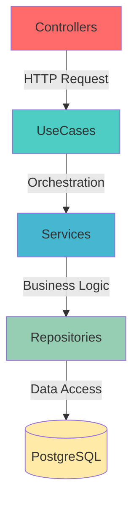

# 🏪 Common Cornershop

<div align="center">


**Sistema de gestão completo para lojinha de esquina**

[Recursos](#-recursos) • [Tecnologias](#-stack-tecnológica) • [Quick Start](#-quick-start) • [Documentação](#-documentação)

</div>

---

## 📋 Visão Geral

**Common Cornershop** é uma API REST robusta e escalável desenvolvida para gestão completa de lojas de esquina (cornershops). O sistema permite gerenciar produtos, categorias, estoque e pedidos de forma eficiente, aplicando princípios de **Domain-Driven Design (DDD)** e **Clean Architecture**.

Construído como um **monorepo gerenciado pelo NX**, o projeto separa claramente as responsabilidades entre camadas de domínio, aplicação e infraestrutura, garantindo manutenibilidade, testabilidade e evolução sustentável do código.

---

## 🎯 Recursos

- ✅ **Gestão de Categorias** - Organização e categorização de produtos
- ✅ **Gestão de Produtos** - CRUD completo com informações de estoque
- ✅ **Controle de Estoque** - Rastreamento de quantidades e alertas de mínimo
- ✅ **Gestão de Pedidos** - Criação, consulta e acompanhamento de status
- ✅ **Paginação Inteligente** - Todas as listagens com suporte a paginação
- ✅ **Filtros Avançados** - Busca por categoria, status, período e mais
- ✅ **Soft Delete** - Dados nunca são perdidos, apenas marcados como deletados
- ✅ **Auditoria Completa** - Timestamps de criação e atualização em todas as entidades

---

## 🚀 Stack Tecnológica

| Tecnologia | Versão | Descrição |
|------------|--------|-----------|
| **NX** | Latest | Gerenciamento de monorepo |
| **TypeScript** | ^5.0.0 | Type safety e melhor DX |
| **Node.js** | ≥18.0.0 | Runtime moderno |
| **Fastify** | Latest | Framework web ultrarrápido |
| **TypeORM** | Latest | ORM com suporte a migrations |
| **Zod** | Latest | Validação type-safe |
| **TSyringe** | Latest | Dependency Injection |
| **PostgreSQL** | ≥14.0 | Banco relacional robusto |

### Padrões Arquiteturais

✅ Domain-Driven Design (DDD)  
✅ Clean Architecture  
✅ Dependency Inversion  
✅ Repository Pattern  
✅ Use Case Pattern  

---

## 📁 Estrutura Resumida

```
common-cornershop/
├── 📦 apps/
│   └── api/                    # Camada de Infraestrutura
│       ├── controllers/        # HTTP Controllers
│       ├── repositories/       # Implementações TypeORM
│       ├── schemas/            # Validação Zod
│       ├── database/           # Migrations & Seeds
│       └── container/          # Dependency Injection
│
├── 📚 libs/
│   ├── domain/                 # Camada de Negócio
│   │   ├── entities/           # Entidades de domínio
│   │   ├── repositories/       # Interfaces
│   │   ├── {module}/use-cases/ # Orquestração
│   │   └── {module}/services/  # Lógica de negócio
│   │
│   └── shared/                 # Utilitários
│       ├── utils/
│       ├── validators/
│       └── types/
│
└── 📄 docs/                    # Documentação detalhada
```

> 📖 **Veja a estrutura completa em:** [docs/project-structure.md](docs/project-structure.md)

---

## 🚀 Quick Start

### Pré-requisitos

- **Node.js** >= 18.0.0
- **Yarn** >= 1.22.0
- **PostgreSQL** >= 14.0
- **Docker** (opcional)

### Instalação

```bash
# 1. Clonar repositório
git clone https://github.com/seu-usuario/common-cornershop.git
cd common-cornershop

# 2. Instalar dependências
yarn install

# 3. Configurar variáveis de ambiente
cp .env.example .env
# Edite o .env com suas configurações

# 4. Subir banco de dados (Docker)
docker-compose up -d postgres

# 5. Executar migrations
yarn migration:run

# 6. Popular dados iniciais (opcional)
yarn seed

# 7. Iniciar aplicação
yarn start:dev
```

A API estará disponível em: **http://localhost:3000**

---

## 🏗️ Arquitetura em Camadas



> 📖 **Veja detalhes em:** [docs/architecture.md](docs/architecture.md)

---

## 📚 Documentação

### [`docs/project-structure.md`](docs/project-structure.md)
Full annotated directory tree of the monorepo. Read this first when navigating the codebase — it maps every directory and file suffix to its role (`*.entity.ts`, `*.usecase.ts`, `*.repository.impl.ts`, etc.) and explains what belongs in each layer.

### [`docs/architecture.md`](docs/architecture.md)
Layer responsibilities, dependency flow diagram (Controllers → UseCases → Services → Repositories), DI patterns with TSyringe, and the rules that define what code is allowed in each layer. Consult before creating any new class or module.

### [`docs/conventions.md`](docs/conventions.md)
All code style rules in one place: naming conventions (camelCase / PascalCase / UPPER_SNAKE_CASE / snake_case), file naming pattern (`{name}.{type}.ts`), import ordering (3-group: external → `@domain/` `@shared/` → relative), JSDoc requirements, and git conventions (Conventional Commits + branch naming).

### [`docs/domain-model.md`](docs/domain-model.md)
ER diagram and description of all domain entities: `Category`, `Product`, `Stock`, `Order`, `OrderItem`. Shows relationships, fields, and the `BaseEntity` (id, createdAt, updatedAt, deletedAt). Reference when adding or modifying entities.

### [`docs/error-handling.md`](docs/error-handling.md)
The full error contract: the JSON envelope format (`error` in English, `message` in pt-BR, no status in body), the `DomainError` hierarchy, how the centralized `setErrorHandler` classifies exceptions (domain / Zod validation / unexpected), the `errorMap`, and the step-by-step for adding a new domain error. Also cross-references ADR-0001 and ADR-0002.

### [`docs/testing.md`](docs/testing.md)
Jest setup for the NX workspace, all test script flags, the AAA (Arrange-Act-Assert) pattern, `describe → describe → it` structure, mocking patterns (including TSyringe container mocks), coverage thresholds (global 80% lines/functions; `*.service.ts` 90%), fixtures/factories conventions, and full example specs for unit, integration (Fastify inject), and E2E tests.

### [`docs/api-endpoints.md`](docs/api-endpoints.md)
Complete REST API reference: every endpoint for Categories, Products, Stock, and Orders — with request/response shapes, query parameters, status codes, and error payloads. Use as the canonical contract when implementing controllers and schemas.

### [`docs/database.md`](docs/database.md)
TypeORM CLI usage, migration workflow, seed scripts, test database setup (port 5433), entity configuration, and soft-delete conventions. Read before writing migrations or repository implementations.

### [`docs/openapi.md`](docs/openapi.md)
How to integrate `@fastify/swagger` + `@fastify/swagger-ui` with existing Zod schemas using `zod-to-json-schema`. Covers plugin registration, route metadata conventions (`tags`, `summary`, `operationId`), and how to keep the Swagger UI at `/docs` in sync with the API.

### [`docs/examples.md`](docs/examples.md)
End-to-end walkthroughs of complete request flows (e.g. creating an order) showing how each layer — controller, use case, service, repository — interacts. Useful for understanding the full call chain before implementing a new feature.

### [`docs/roadmap.md`](docs/roadmap.md)
Implementation roadmap for the MVP: phases, task breakdown, dependencies between tasks, and done criteria. Consult to understand what has been prioritized and in what order work should proceed.

### [`docs/adr/0001-idioma-mensagens-de-erro.md`](docs/adr/0001-idioma-mensagens-de-erro.md)
Decision record: all code in English; user-facing `message` fields in pt-BR. Defines where to centralize error message strings (`libs/shared/src/errors/messages/`) and the future i18n migration path.

### [`docs/adr/0002-error-handler-centralizado.md`](docs/adr/0002-error-handler-centralizado.md)
Decision record: single global `fastify.setErrorHandler` registered at bootstrap (`apps/api/src/plugins/error-handler.plugin.ts`). Prohibits scattered per-route error handling and defines the three classification categories the handler must cover.

---

## 🔜 Próximos Passos

### Features Planejadas

- [ ] **Autenticação & Autorização** - JWT, roles (admin, user)
- [ ] **Webhooks** - Notificações de mudança de status
- [ ] **Relatórios** - Vendas por período, produtos mais vendidos
- [ ] **Alertas de Estoque** - Notificação quando estoque < mínimo
- [ ] **Gestão de Clientes** - CRUD de clientes
- [ ] **Pagamentos** - Integração com gateways
- [x] **API Documentation** - Swagger/OpenAPI ([📐 OpenAPI / Swagger](docs/openapi.md))
- [ ] **Rate Limiting** - Proteção contra abuso
- [ ] **Caching** - Redis para listagens
- [ ] **CI/CD** - GitHub Actions

### Melhorias Técnicas

- [ ] Testes de integração completos
- [ ] Documentation as Code (Typedoc)
- [ ] Husky + Commitlint
- [ ] Health checks
- [ ] Docker multi-stage

---

## 🤝 Contribuindo

Contribuições são bem-vindas! Para contribuir:

1. Fork o projeto
2. Crie uma branch para sua feature (`git checkout -b feat/amazing-feature`)
3. Commit suas mudanças (`git commit -m 'feat: add amazing feature'`)
4. Push para a branch (`git push origin feat/amazing-feature`)
5. Abra um Pull Request

**Lembre-se de:**
- Seguir as [convenções de nomenclatura](docs/conventions.md)
- Escrever testes para novas funcionalidades
- Atualizar a documentação
- Seguir o padrão [Conventional Commits](https://www.conventionalcommits.org/)

---

## 📄 Licença

Este projeto está sob a licença MIT. Veja o arquivo [LICENSE](LICENSE) para mais detalhes.

---

## 📧 Contato

Para dúvidas, sugestões ou contribuições:

- **Email**: seu-email@example.com
- **GitHub**: [@seu-usuario](https://github.com/seu-usuario)

---

<div align="center">

**Feito com ❤️ para lojas de esquina**

[⬆ Voltar ao topo](#-common-cornershop)

</div>
