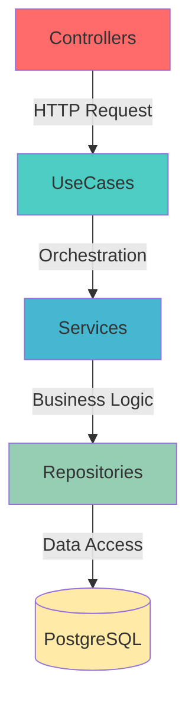
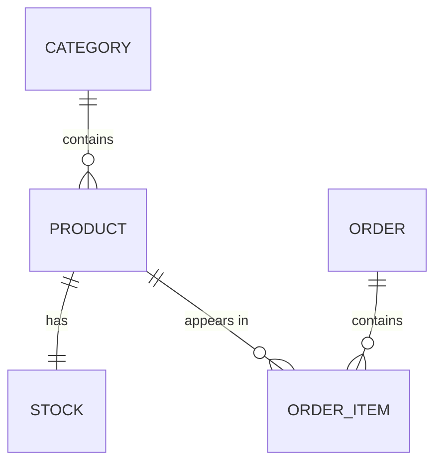

# 🏪 Common Cornershop

<div align="center">


**Sistema de gestão completo para lojinha de esquina**

[Recursos](#-recursos) • [Tecnologias](#-stack-tecnológica) • [Quick Start](#-quick-start) • [Documentação](#-documentação)

</div>

---

## 📋 Visão Geral

**Common Cornershop** é uma API REST robusta e escalável desenvolvida para gestão completa de lojas de esquina (cornershops). O sistema permite gerenciar produtos, categorias, estoque e pedidos de forma eficiente, aplicando princípios de **Domain-Driven Design (DDD)** e **Clean Architecture**.

Construído como um **monorepo gerenciado pelo NX**, o projeto separa claramente as responsabilidades entre camadas de domínio, aplicação e infraestrutura, garantindo manutenibilidade, testabilidade e evolução sustentável do código.

---

## 🎯 Recursos

- ✅ **Gestão de Categorias** - Organização e categorização de produtos
- ✅ **Gestão de Produtos** - CRUD completo com informações de estoque
- ✅ **Controle de Estoque** - Rastreamento de quantidades e alertas de mínimo
- ✅ **Gestão de Pedidos** - Criação, consulta e acompanhamento de status
- ✅ **Paginação Inteligente** - Todas as listagens com suporte a paginação
- ✅ **Filtros Avançados** - Busca por categoria, status, período e mais
- ✅ **Soft Delete** - Dados nunca são perdidos, apenas marcados como deletados
- ✅ **Auditoria Completa** - Timestamps de criação e atualização em todas as entidades

---

## 🚀 Stack Tecnológica

| Tecnologia | Versão | Descrição |
|------------|--------|-----------|
| **NX** | Latest | Gerenciamento de monorepo |
| **TypeScript** | ^5.0.0 | Type safety e melhor DX |
| **Node.js** | ≥18.0.0 | Runtime moderno |
| **Fastify** | Latest | Framework web ultrarrápido |
| **TypeORM** | Latest | ORM com suporte a migrations |
| **Zod** | Latest | Validação type-safe |
| **TSyringe** | Latest | Dependency Injection |
| **PostgreSQL** | ≥14.0 | Banco relacional robusto |

### Padrões Arquiteturais

✅ Domain-Driven Design (DDD)  
✅ Clean Architecture  
✅ Dependency Inversion  
✅ Repository Pattern  
✅ Use Case Pattern  

---

## 📁 Estrutura Resumida

```
common-cornershop/
├── 📦 apps/
│   └── api/                    # Camada de Infraestrutura
│       ├── controllers/        # HTTP Controllers
│       ├── repositories/       # Implementações TypeORM
│       ├── schemas/            # Validação Zod
│       ├── database/           # Migrations & Seeds
│       └── container/          # Dependency Injection
│
├── 📚 libs/
│   ├── domain/                 # Camada de Negócio
│   │   ├── entities/           # Entidades de domínio
│   │   ├── repositories/       # Interfaces
│   │   ├── {module}/use-cases/ # Orquestração
│   │   └── {module}/services/  # Lógica de negócio
│   │
│   └── shared/                 # Utilitários
│       ├── utils/
│       ├── validators/
│       └── types/
│
└── 📄 docs/                    # Documentação detalhada
```

> 📖 **Veja a estrutura completa em:** [docs/project-structure.md](docs/project-structure.md)

---

## 🚀 Quick Start

### Pré-requisitos

- **Node.js** >= 18.0.0
- **Yarn** >= 1.22.0
- **PostgreSQL** >= 14.0
- **Docker** (opcional)

### Instalação

```bash
# 1. Clonar repositório
git clone https://github.com/seu-usuario/common-cornershop.git
cd common-cornershop

# 2. Instalar dependências
yarn install

# 3. Configurar variáveis de ambiente
cp .env.example .env
# Edite o .env com suas configurações

# 4. Subir banco de dados (Docker)
docker-compose up -d postgres

# 5. Executar migrations
yarn migration:run

# 6. Popular dados iniciais (opcional)
yarn seed

# 7. Iniciar aplicação
yarn start:dev
```

A API estará disponível em: **http://localhost:3000**

---

## 📚 Documentação

### 📖 Documentação Completa

| Documento | Descrição |
|-----------|-----------|
| [🏗️ Arquitetura](docs/architecture.md) | Visão de camadas, fluxo de dependências, princípios DDD |
| [📊 Modelo de Domínio](docs/domain-model.md) | Entidades, relacionamentos, regras de negócio |
| [🔌 API Endpoints](docs/api-endpoints.md) | Documentação completa de todos os endpoints |
| [🎨 Convenções](docs/conventions.md) | Nomenclatura, commits, padrões de código |
| [🗄️ Database](docs/database.md) | Migrations, seeds, estratégias de versionamento |
| [📁 Estrutura do Projeto](docs/project-structure.md) | Organização detalhada do monorepo |
| [🔄 Exemplos](docs/examples.md) | Fluxos completos com código e diagramas |
| [🧪 Testes](docs/testing.md) | Jest, testes unitários, integração e E2E |
| [🗺️ Roadmap](roadmap.md) | Plano de implementação, tasks, dependências e paralelismo |

### 🔗 Links Rápidos

- **Arquitetura**: Como as camadas se comunicam → [architecture.md](docs/architecture.md)
- **Entidades**: Category, Product, Stock, Order → [domain-model.md](docs/domain-model.md)
- **Endpoints**: GET/POST para pedidos e produtos → [api-endpoints.md](docs/api-endpoints.md)
- **Convenções**: Como nomear variáveis e commits → [conventions.md](docs/conventions.md)
- **Roadmap**: Tasks, dependências e paralelismo da implementação → [roadmap.md](roadmap.md)

---

## 📝 Scripts Principais

```bash
# Desenvolvimento
yarn start:dev              # Inicia em modo watch
yarn lint                   # Executa linter
yarn format                 # Formata código

# Testes
yarn test                   # Todos os testes
yarn test:unit              # Testes unitários
yarn test:integration       # Testes de integração
yarn test:e2e               # Testes E2E
yarn test:watch             # Watch mode
yarn test:coverage          # Com cobertura

# Build
yarn build                  # Compila o projeto
yarn build:api              # Compila apenas a API

# Migrations
yarn migration:generate     # Gera nova migration
yarn migration:run          # Executa migrations
yarn migration:revert       # Reverte última migration

# Seeds
yarn seed                   # Executa todos os seeds

# NX
yarn nx graph               # Visualiza grafo de dependências
yarn nx affected:test       # Testa apenas projetos afetados
```

---

## 🎯 Principais Endpoints

### Categorias

```http
GET    /api/categories           # Listar categorias
GET    /api/categories/:id       # Obter categoria
```

### Produtos

```http
GET    /api/products             # Listar produtos (com filtros)
GET    /api/products/:id         # Obter produto (com estoque)
```

### Pedidos

```http
POST   /api/orders               # Criar pedido
GET    /api/orders               # Listar pedidos (com filtros)
GET    /api/orders/:id           # Obter pedido completo
GET    /api/orders/:id/status    # Obter apenas status
```

> 📖 **Veja exemplos completos em:** [docs/api-endpoints.md](docs/api-endpoints.md)

---

## 🏗️ Arquitetura em Camadas



> 📖 **Veja detalhes em:** [docs/architecture.md](docs/architecture.md)

---

## 📊 Modelo de Dados

O sistema gerencia 5 entidades principais:

1. **Category** - Organização de produtos
2. **Product** - Produtos vendidos
3. **Stock** - Controle de estoque
4. **Order** - Pedidos realizados
5. **OrderItem** - Items dentro de pedidos



> 📖 **Veja modelo completo em:** [docs/domain-model.md](docs/domain-model.md)

---

## 🧪 Testes

```bash
# Testes unitários
yarn test

# Testes com watch
yarn test:watch

# Testes com cobertura
yarn test:cov

# Testes e2e
yarn test:e2e
```

---

## 🔜 Próximos Passos

### Features Planejadas

- [ ] **Autenticação & Autorização** - JWT, roles (admin, user)
- [ ] **Webhooks** - Notificações de mudança de status
- [ ] **Relatórios** - Vendas por período, produtos mais vendidos
- [ ] **Alertas de Estoque** - Notificação quando estoque < mínimo
- [ ] **Gestão de Clientes** - CRUD de clientes
- [ ] **Pagamentos** - Integração com gateways
- [ ] **API Documentation** - Swagger/OpenAPI
- [ ] **Rate Limiting** - Proteção contra abuso
- [ ] **Caching** - Redis para listagens
- [ ] **CI/CD** - GitHub Actions

### Melhorias Técnicas

- [ ] Testes de integração completos
- [ ] Documentation as Code (Typedoc)
- [ ] Husky + Commitlint
- [ ] Health checks
- [ ] Docker multi-stage

---

## 🤝 Contribuindo

Contribuições são bem-vindas! Para contribuir:

1. Fork o projeto
2. Crie uma branch para sua feature (`git checkout -b feat/amazing-feature`)
3. Commit suas mudanças (`git commit -m 'feat: add amazing feature'`)
4. Push para a branch (`git push origin feat/amazing-feature`)
5. Abra um Pull Request

**Lembre-se de:**
- Seguir as [convenções de nomenclatura](docs/conventions.md)
- Escrever testes para novas funcionalidades
- Atualizar a documentação
- Seguir o padrão [Conventional Commits](https://www.conventionalcommits.org/)

---

## 📄 Licença

Este projeto está sob a licença MIT. Veja o arquivo [LICENSE](LICENSE) para mais detalhes.

---

## 📧 Contato

Para dúvidas, sugestões ou contribuições:

- **Email**: seu-email@example.com
- **GitHub**: [@seu-usuario](https://github.com/seu-usuario)

---

<div align="center">

**Feito com ❤️ para lojas de esquina**

[⬆ Voltar ao topo](#-common-cornershop)

</div>
