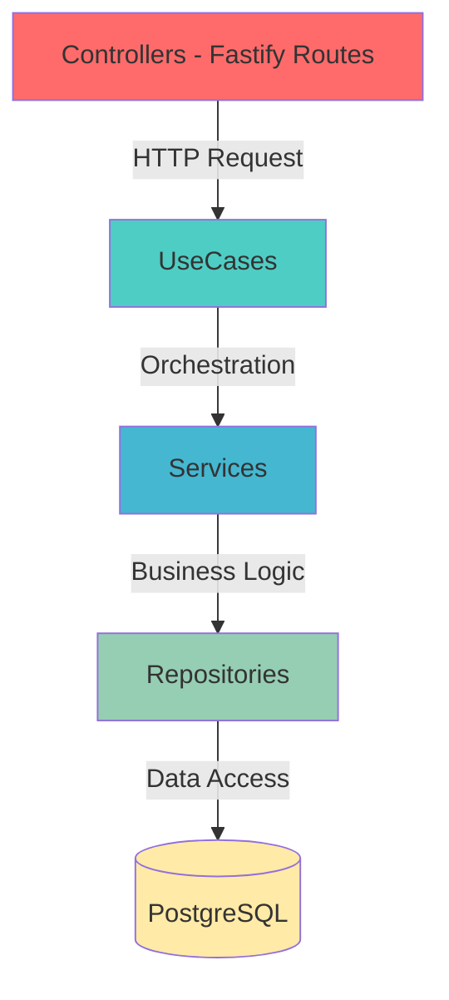
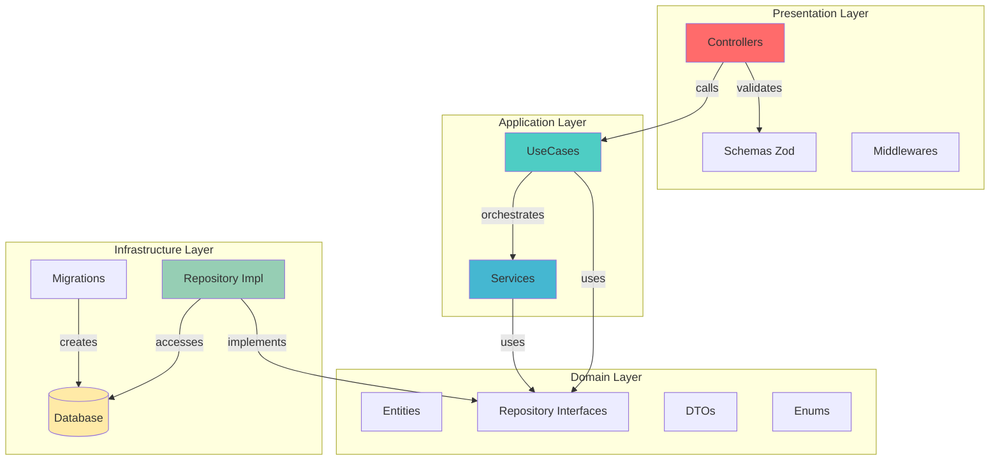
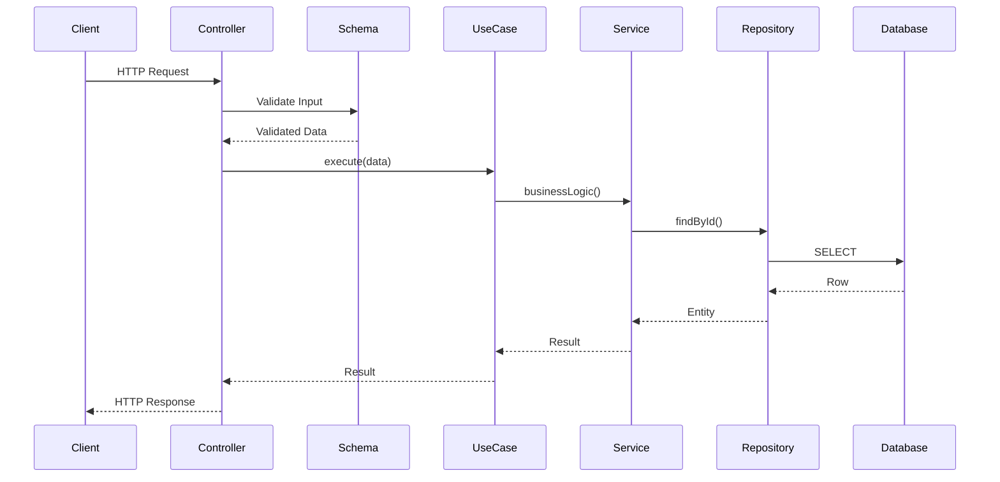

# 🏗️ Arquitetura

## Visão Geral

O Common Cornershop segue uma arquitetura em camadas baseada em **Domain-Driven Design (DDD)** e **Clean Architecture**, com clara separação de responsabilidades e inversão de dependência.

---

## Visão de Camadas



---

## Fluxo de Dependências

```
┌─────────────────────────────────────────────────────────┐
│                     apps/api/                           │
│  (Infraestrutura & Apresentação)                        │
│  • Controllers                                           │
│  • Repository Implementations (TypeORM)                 │
│  • Schemas (Zod)                                        │
│  • Migrations & Seeds                                    │
│  • DI Container                                          │
└────────────────┬────────────────────────────────────────┘
                 │ depende de ↓
┌────────────────▼────────────────────────────────────────┐
│                    libs/domain/                         │
│  (Lógica de Negócio & Domínio)                         │
│  • Entities                                             │
│  • Repository Interfaces                                │
│  • UseCases                                             │
│  • Services                                             │
│  • DTOs & Enums                                         │
└────────────────┬────────────────────────────────────────┘
                 │ depende de ↓
┌────────────────▼────────────────────────────────────────┐
│                    libs/shared/                         │
│  (Utilitários Compartilhados)                           │
│  • Helpers                                              │
│  • Validators                                           │
│  • Types                                                │
│  • Constants                                            │
└─────────────────────────────────────────────────────────┘
```

---

## Princípios Arquiteturais

### 1. Inversão de Dependência

- A camada de **domínio** define as interfaces dos repositórios
- A camada de **aplicação** (api) implementa essas interfaces usando TypeORM
- O domínio **nunca** depende de detalhes de infraestrutura

### 2. Separação de Responsabilidades

#### Controllers (Apresentação)
- Recebem requests HTTP
- Validam input usando Zod schemas
- Delegam para UseCases
- Formatam responses HTTP

#### UseCases (Orquestração)
- Ponto de entrada da lógica de negócio
- Orquestram chamadas a múltiplos Services
- Coordenam transações
- Implementam casos de uso específicos

#### Services (Lógica de Negócio)
- Unidades reutilizáveis de lógica de negócio
- Podem ser compostos por UseCases
- Focados em uma única responsabilidade
- Independentes de framework

#### Repositories (Acesso a Dados)
- Abstração sobre persistência
- Implementam interfaces definidas no domínio
- Encapsulam queries e operações de banco

---

## Padrões Arquiteturais Aplicados

✅ **Domain-Driven Design (DDD)**
- Entidades ricas com comportamento
- Bounded contexts bem definidos
- Ubiquitous language no código

✅ **Clean Architecture (Hexagonal Architecture)**
- Domínio independente de frameworks
- Inversão de dependências
- Testabilidade facilitada

✅ **Dependency Inversion Principle**
- Interfaces definem contratos
- Implementações são injetadas
- Baixo acoplamento

✅ **Repository Pattern**
- Abstração de acesso a dados
- Facilita troca de persistência
- Queries centralizadas

✅ **Use Case Pattern**
- Cada operação de negócio é um UseCase
- Orquestração explícita
- Reutilização de Services

✅ **Service Layer Pattern**
- Lógica de negócio reutilizável
- Composição de comportamentos
- Testabilidade unitária

✅ **OpenAPI / Swagger**
- Documentação de endpoints gerada automaticamente via `@fastify/swagger`
- Schemas Zod convertidos para JSON Schema via `zod-to-json-schema`
- UI interativa disponível em `/docs`

✅ **Global Error Handler**
- Handler centralizado via `setErrorHandler` do Fastify
- Erros de domínio mapeados para HTTP via `errorMap` explícito
- Detalhes em [docs/error-handling.md](error-handling.md)

---

## Benefícios da Arquitetura

### 🎯 Manutenibilidade
- Separação clara de responsabilidades
- Fácil localização de código
- Mudanças isoladas

### 🔄 Testabilidade
- Domínio testável sem infraestrutura
- Mocks simples via interfaces
- Testes unitários rápidos

### 📈 Escalabilidade
- Fácil adicionar novos casos de uso
- Evolução independente de camadas
- Preparado para crescimento

### 🔌 Extensibilidade
- Novos repositórios sem mudar domínio
- Troca de frameworks facilitada
- Integrações isoladas

### 👥 Colaboração
- Estrutura previsível
- Convenções claras
- Onboarding facilitado

---

## Diagrama de Componentes



> Nota: o Swagger Plugin (responsável por expor a UI em `/docs` e os specs JSON/YAML) faz parte da "Presentation Layer" e consome os Zod schemas para gerar a documentação interativa.

---

## Fluxo de uma Request



---

## Dependency Injection

O projeto utiliza **TSyringe** para injeção de dependências, garantindo:

- ✅ Baixo acoplamento entre camadas
- ✅ Facilita testes com mocks
- ✅ Configuração centralizada
- ✅ Type-safety em tempo de compilação

### Configuração

```typescript
// apps/api/src/container/dependency-injection.ts
container.register<IProductRepository>(
  'IProductRepository',
  { useClass: ProductRepositoryImpl }
);

container.register<IListProductsUseCase>(
  'ListProductsUseCase',
  { useClass: ListProductsUseCase }
);
```

### Uso

```typescript
// Injeção no construtor
export class ProductController {
  constructor(
    @inject('ListProductsUseCase') 
    private listProductsUseCase: IListProductsUseCase
  ) {}
}
```

---

## Considerações de Design

### Por que NX Monorepo?

- ✅ Compartilhamento de código entre apps
- ✅ Cache inteligente de builds
- ✅ Análise de dependências
- ✅ Geração de código consistente
- ✅ Testes e builds paralelos

### Por que Separar UseCases e Services?

- **UseCases**: Orquestram um fluxo de negócio completo (ex: CreateOrder)
- **Services**: Realizam operações atômicas reutilizáveis (ex: calculateTotal)
- **Benefício**: Services podem ser compostos por múltiplos UseCases

### Por que Interfaces no Domínio?

- Domínio não depende de implementações específicas
- Facilita testes com mocks
- Permite trocar implementação (ex: TypeORM → Prisma) sem mudar domínio

---

## Evolução da Arquitetura

### Atual: Modular Monolith
- Todos os módulos em um único processo
- Separação lógica por camadas
- Deploy único e simples

### Futuro: Microserviços (se necessário)
- Cada módulo pode virar um serviço independente
- Comunicação via eventos/APIs
- Escalabilidade horizontal

**A arquitetura atual já prepara para essa evolução!**

---

[⬆ Voltar para README](../README.md)
