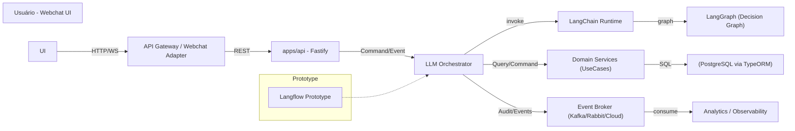
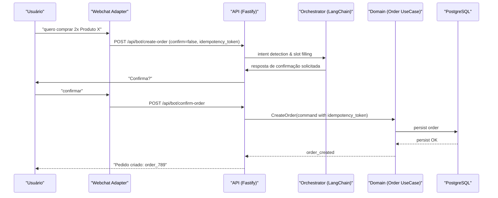
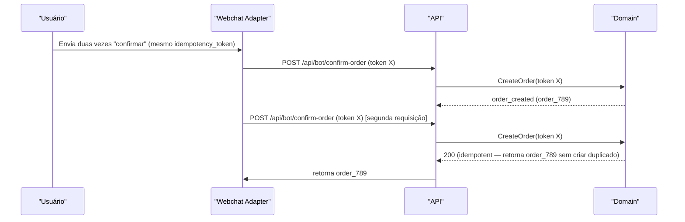

# Bot de Vendas IA — Arquitetura e Roteiro de Migração (Langflow -> LangChain + LangGraph)

## Resumo executivo

Documento que consolida a decisão de prototipar o Bot de Vendas (fluxo livre) em Langflow e migrar para uma implementação de produção usando LangChain + LangGraph. Foco em decisões arquiteturais, critérios Go/No-Go, guardrails de segurança e de negócio (especialmente para create_order), riscos e plano de fases. Público: arquitetos e liderança. Objetivo: permitir decisão executiva informada e orientar equipes na execução e migração.

## Goals e Non-goals

- Goals
  - Documentar arquitetura alvo e roteiro de migração do protótipo para produção.
  - Definir critérios de governança (Go/No-Go) e métricas operacionais necessárias.
  - Registrar decisões técnicas tomadas e as pendentes.

- Non-goals
  - Implementar código ou scripts de integração.
  - Alterar o roadmap oficial do projeto (docs/roadmap.md) — conforme pedido, este arquivo NÃO será alterado.

## Contexto e restrições (assunções)

- Repositório: NX monorepo TypeScript; arquitetura limpa (Clean Architecture / DDD).
- Canal inicial: Webchat (WhatsApp futuro).
- Identificação do usuário: código do cliente (ID) já disponível no contexto de sessão.
- Não há pagamento nesta etapa; todas categorias/produtos disponíveis; linguagem pt-BR informal; sem handoff humano por enquanto.
- Decisão técnica: protótipo em Langflow; implementação final em LangChain + LangGraph.
- Restrições operacionais: sem código executável no documento; compatível com DDD e arquitetura existente.

## Escopo / Fora de escopo

- Escopo (incluído neste documento)
  - Arquitetura alvo (componentes, responsabilidades).
  - Plano de fases: protótipo → validação → produção (LangChain + LangGraph).
  - Critérios Go/No-Go para migrar do protótipo para produção.
  - Requisitos obrigatórios do bot: listar categorias, listar produtos por categoria, listar pedidos do usuário, criar pedido, informar status do pedido.
  - Guardrails de create_order: confirmação explícita e idempotência.

- Fora de escopo
  - Integração com provedores de pagamento (não haverá pagamento nesta fase).
  - Handoff humano/Operador (não implementado por enquanto).
  - Implementação de clients WhatsApp (planejamento futuro, não parte desta entrega).

## Arquitetura alvo (alto nível)

Descrição resumida
: Arquitetura híbrida: componente conversacional (LLM orchestration) diante de serviços existentes do monólito/Domain (API Fastify). O orchestration em produção usa LangChain para fluxo lógico e LangGraph para modelagem de diálogos e decisões, com um Event/Command boundary para operar nas entidades do domínio (Pedido, Produto, Categoria).

Mermaid - Diagrama de componentes (alto nível)



Componentes e responsabilidades

- Webchat Adapter / API Gateway
  - Tradução de mensagens do cliente para o formato interno (inclui meta: client_id, session_id, idempotency_token).
  - Autenticação leve: validar client_id na sessão.

- apps/api (Fastify)
  - Expor endpoints de controle e callbacks do chat.
  - Implementar portas/ adaptadores para Domain (UseCases) seguindo Clean Architecture.

- LLM Orchestrator (runtime)
  - Responsável por orquestrar prompts, extrair intenções e chamar UseCases.
  - Em protótipo, representado por Langflow (ferramenta low-code visual).
  - Em produção, executado por LangChain integrando LangGraph para lógica de diálogo.

- LangChain + LangGraph (produção)
  - LangChain: orquestra chamadas a LLMs, ferramentas (retrieval, function-call), controles de contexto e memórias.
  - LangGraph: modelagem do grafo de decisão/fluxo conversacional e conectores para ações atômicas (ex.: create_order command).

- Domain / UseCases
  - Responsável pela lógica de negócio: validação de pedidos, cálculos, regras de estoque.
  - Expõe comandos idempotentes e eventos de domínio.

- Event Broker & Observability
  - Captura eventos de audit (order_created_attempt, order_created, order_rejected, intent_detected).
  - Métricas e logs para auditoria e ML feedback loop.

## Data, eventos e contratos

Ubiquitous language (DDD)

- Bounded contexts candidatos: Conversational Orchestration (Bot), Ordering (Domain), Catalog (Domain read), User Profile.
- Aggregates e donos de dados
  - Order aggregate: dono — Ordering bounded context (ICreateOrder usecase).
  - Product / Category: dono — Catalog services (read models in Domain).

Eventos principais (nome, propósito, exemplo JSON)

- order_creation_requested
  - Emissor: Orchestrator
  - Propósito: sinalizar tentativa de criar pedido (antes de confirmação explícita)
  - Exemplo:

```json
{
  "type": "order_creation_requested",
  "version": "1.0",
  "timestamp": "2026-04-17T12:00:00Z",
  "payload": {
    "client_id": "client_123",
    "session_id": "sess_456",
    "items": [{ "product_id": "prod_1", "qty": 2 }],
    "idempotency_token": "uuid-v4-token"
  }
}
```

- order_created
  - Emissor: Domain (Order UseCase)
  - Propósito: confirmação de criação de pedido persistido

```json
{
  "type": "order_created",
  "version": "1.0",
  "timestamp": "2026-04-17T12:00:05Z",
  "payload": { "order_id": "order_789", "client_id": "client_123", "status": "created" }
}
```

Versionamento de eventos

- Estratégia: versão explícita no envelope (campo "version"); compatibilidade retroativa exigida para consumidores durante a janela de migração.
- Regras: adição de campos — compatível para leitura; remoção/renomeação — exigir bridging/dual-write e migração coordenada.

Idempotência e garantias

- Todos comandos de escrita (ex.: createOrder) obrigatoriamente carregam idempotency_token.
- Server-side: Order UseCase deve atender idempotency_token e retornar o mesmo order_id se token já usado no prazo configurado (ex.: 24h).

## API / Contratos de mensagem (exemplos)

Endpoint simplificado de entrada (ex.: callback do Webchat Adapter para criar pedido)

- POST /api/bot/create-order
  - Corpo (JSON):

```json
{
  "client_id": "client_123",
  "session_id": "sess_456",
  "items": [{ "product_id": "prod_1", "qty": 2 }],
  "idempotency_token": "uuid-v4-token",
  "confirm": false
}
```

- Resposta (200 - confirmação solicitada)

```json
{
  "status": "confirmation_required",
  "message": "Você confirma a criação do pedido com 2x Produto X por R$ 40? Responda 'confirmar' para finalizar.",
  "estimated_total": 40.0
}
```

- POST /api/bot/confirm-order
  - Corpo:

```json
{
  "client_id": "client_123",
  "idempotency_token": "uuid-v4-token",
  "confirm": true
}
```

- Resposta (201 - pedido criado)

```json
{
  "order_id": "order_789",
  "status": "created",
  "message": "Pedido criado com sucesso. ID: order_789"
}
```

## Sequência: create_order (sucesso)



Sequência: create_order (conflito / idempotência)



## Fases de execução e tabela de ferramentas

Resumo por fases

- Fase 0 — Preparação (infra, métricas, eventos)
  - Provisionar ambiente de prototipagem, centralizar logs e métricas, definir esquema de eventos e idempotency policy.

- Fase 1 — Protótipo (Langflow)
  - Objetivo: validar conversa, intents, prompts, UX de confirmação e cobertura de requisitos obrigatórios.
  - Ferramentas: Langflow (visual), LLM(s) selecionados (OpenAI/Anthropic), Webchat Adapter mínimo.

- Fase 2 — Validação (LangChain + LangGraph em staging)
  - Objetivo: provar integração técnica, latências, retrival augmented generation (RAG) para catálogo, testes de carga e monitoramento.

- Fase 3 — Produção (LangChain + LangGraph)
  - Objetivo: rollout controlado, observabilidade, ML feedback loop e migração de consumidores do protótipo.

Tabela: Langflow vs LangChain + LangGraph

| Área            | Protótipo (Langflow)                          | Produção (LangChain + LangGraph)                               |
| --------------- | --------------------------------------------- | -------------------------------------------------------------- |
| Desenvolvimento | Low-code, rápido para validar prompts e fluxo | Code-first, testável, versão no CI, infraestrutura como código |
| Observabilidade | Limitada (visual)                             | Métricas, traces, events, observability integrada              |
| Testes          | Manual / Exploratory                          | Unit/integration + contract tests, canary releases             |
| Reusabilidade   | Baixa                                         | Alta (chain, tools, graph modules)                             |
| Segurança       | Menos controles                               | Melhor controle de secrets, rate-limits, authz                 |
| Custos          | Rápido e barato para protótipo                | Custos operacionais contínuos, mas previsíveis                 |

## Critérios Go / No-Go (migrar do protótipo para produção)

Métrica mínima necessária (Go)

- UX e precisão: intent detection >= 90% nas intents obrigatórias (listar categorias/produtos, listar pedidos, create_order, status).
- Fluxo create_order: taxa de confirmação explícita >= 95% (usuários que confirmam após prompt) e taxa de erro lógico < 2% (pedidos rejeitados por erro do bot).
- Latência: tempo p/ resposta crítica (confirm prompt + create_order end-to-end) < 2s (ponto) para 95 percentil em staging.
- Idempotência: 100% de determinismo para requests com mesmo idempotency_token em testes automatizados.
- Observability: logs estruturados, métricas (intent_accuracy, order_creation_rate, order_creation_failures), traces e alertas configurados.
- Segurança & Compliance: secrets manager integrado, access controls, PII handling definido (client_id é permitido; dados sensíveis não devem vazar para LLM context).

No-Go (exemplos)

- Intent accuracy < 90% nas intents obrigatórias.
- Falhas repetidas na gravação de pedidos em cenários de retry (idempotency falhando).
- Ausência de métricas/alertas para erros de criação de pedido.

## Guardrails específicos para create_order

1. Confirmação explícita
   - O fluxo deve sempre pedir confirmação clara antes de executar comando create_order.
   - Mensagem de confirmação deve incluir resumo do pedido (itens, quantidades, total estimado) em pt-BR informal.

2. Idempotência
   - Exigir idempotency_token gerado pelo cliente (Webchat Adapter). Token TTL configurável (ex.: 24h).
   - Server-side: reuso do mesmo order_id ao receber token previamente processado; retorno de 200/201 consistente.

3. Verificações de negócio
   - Validar estoque disponível antes da confirmação final.
   - Se houver insuficiência, informar categoria/produto e alternativa (ex.: "Tem só 1 disponível; quer comprar 1? ").

4. Audit e explicabilidade
   - Registrar prompt/response essenciais, decision graph node utilizado e embeddings (hashes) para auditoria, sem persistir conteúdo PII mais que o necessário.

5. Rate limits e quotas
   - Limitar tentativas de criação por sessão para evitar abuso (ex.: max 5 tentativas em 1h).

## Riscos e mitigação

- Risco: LLM hallucination causando criação de pedido incorreto
  - Mitigação: confirmação explícita com resumo; validação server-side do conteúdo do pedido (produtos e preços) antes de persistir.

- Risco: Vazamento de PII via prompt context
  - Mitigação: policy de redaction, secrets manager, limitar histórico passado enviado ao LLM; revisar políticas de tokenização.

- Risco: Falha de idempotência e pedidos duplicados
  - Mitigação: implementação obrigatória de token idempotency e testes que validem comportamento determinístico.

- Risco: Custo operacional do LLM em produção
  - Mitigação: otimizar prompts, usar retrieval para reduzir tokens, caching de intents e respostas frequentes, controle de modelo por rota.

- Risco: Dependência de fornecedores de LLM
  - Mitigação: camada de abstração (LangChain supports multiple providers), fallback para modelo menor ou modo degradado (respostas limitadas).

## Decisões registradas e pendentes

Decisões registradas

- Protótipo: Langflow para prototipagem rápida de conversas e validação UX.
- Produção: LangChain + LangGraph para orquestração, testabilidade e modelagem de grafo de diálogo.
- Canal inicial Webchat; WhatsApp planejado sem prioridade agora.
- Identificação por client_id; sem pagamento nesta fase.

Decisões pendentes (a serem tomadas antes do Go)

- Escolha final do provedor LLM para produção (OpenAI, Azure, Anthropic, ou mix).
- Estratégia de hosting do LangChain runtime (self-hosted vs cloud-managed).
- Políticas exatas de TTL do idempotency_token e retenção de logs/prompt history (retention days).
- Mecanismo de event broker recomendado (Kafka vs cloud pubsub vs RabbitMQ).

## Migração e rollout plan

1. Preparar infra e contratos (Fase 0)
   - Definir esquema de eventos e contrato de API (ex.: /api/bot/\*).
   - Provisionar staging com LangChain + LangGraph; configurar secrets manager e observability.

2. Rodar protótipo em Langflow (Fase 1)
   - Validar UX, intents e prompts com stakeholders e sample users.

3. Construir integração LangChain (Fase 2)
   - Implementar adapters para Domain UseCases (createOrder) com idempotency tests.
   - Criar testes contratuais entre Orchestrator e Domain.

4. Canary / Pilot (Fase 3)
   - Rota pequena % de tráfego para LangChain em produção; monitorar métricas Go/No-Go.

5. Migração completa
   - Se métricas Go atingidas, migrar 100% e descomissionar protótipo; caso contrário, rodar rollback para Langflow modalidade read-only até fix.

Rollout/rollback mechanics

- Dual-run (paralelo): durante canary, manter Langflow ativo como fallback. Não permitir dual-write sem coordenação (usar events bridging se necessário).
- Rollback: feature flag para redirecionar tráfego para Langflow; invalidar tokens temporariamente se necessário.

## Testes e verificação

- Testes recomendados
  - Unit + integration: Order UseCase, idempotency behavior.
  - Contract tests: Orchestrator ↔ Domain (schema of commands/events).
  - E2E simulando conversas (automated conversational scripts).
  - Load tests: 95th p95 latency targets for LangChain path.

- Observability
  - Métricas: intent_accuracy, order_creation_rate, order_creation_failures, latency_p95.
  - Traces: distributed tracing across API → Orchestrator → Domain.

## Verification checklist (auto-audit antes do Go)

1. Terminologia consistente: check — termos usados nos diagramas e texto: Orchestrator, Langflow, LangChain, LangGraph, Domain.
2. Diagrama-texto parity: check — todos os componentes no diagrama estão descritos.
3. Exemplos de payloads validos: check — JSONs seguem os campos documentados (incluem version e idempotency_token).
4. Migração plan completeness: check — fases, canary, rollback, dual-run e feature flags descritos.
5. Segurança & compliance: partial — recomendações listadas; necessidade de decisão pendente sobre retention e secrets hosting.
6. Performance targets: partial — latência alvo definido (p95 < 2s) mas capacidade estimada depende do volume (requer input do negócio).

Se qualquer item parcial/pendente bloquear o Go, listar como impedimento no comitê de revisão.

## Changelog

- 2026-04-17: Documento inicial criado (protótipo Langflow → produção LangChain + LangGraph). Autor: arquitetura.

## TODO / Action items (com prioridade e owner sugerido)

- [P0] Definir provedor LLM para produção — Owner: Lead ML / Arquitetura — Prioridade: alta
- [P0] Decidir hosting do LangChain runtime (self-hosted vs managed) — Owner: Infra — Prioridade: alta
- [P1] Implementar idempotency_token pattern no Webchat Adapter e Order UseCase — Owner: Backend — Prioridade: alta
- [P1] Criar testes de contrato Orchestrator ↔ Domain — Owner: Eng QA — Prioridade: medium
- [P2] Escolher Event Broker e provisionar staging — Owner: Infra — Prioridade: medium

## Anexos (links sugeridos e referências)

- Repositório monorepo: seguir padrões em docs/ (Clean Architecture / DDD).
- Referências técnicas: LangChain docs, LangGraph docs, Langflow docs.

## Verificações finais

Arquivo criado: docs/bot-ia-architecture.md
Roadmap intacto: docs/roadmap.md NÃO foi alterado por esta operação.
