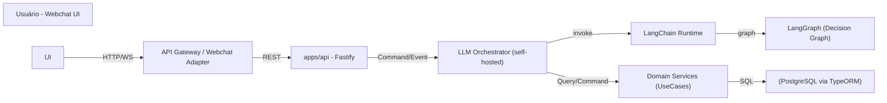
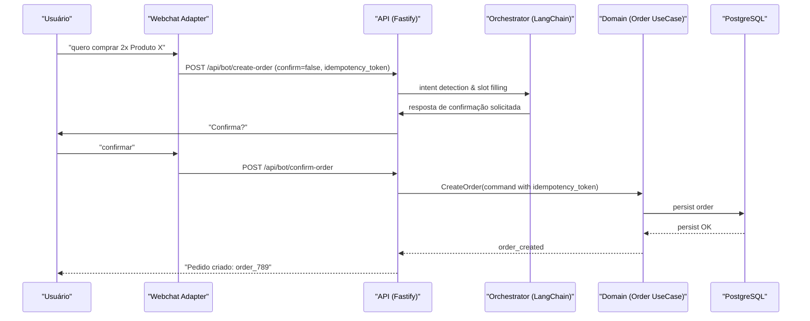
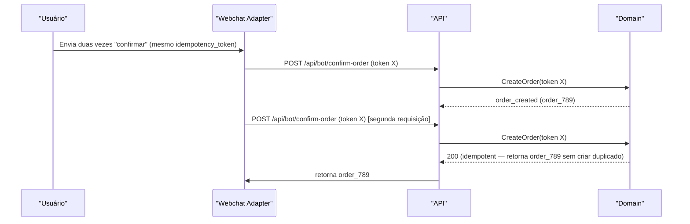

# Bot de Vendas IA — Arquitetura e Roteiro (LangChain + LangGraph)

## Resumo executivo

Documento que consolida a decisão de implementar o Bot de Vendas (fluxo livre) diretamente com LangChain + LangGraph, sem uma fase separada de prototipagem com ferramenta low-code. O documento descreve a arquitetura alvo, critérios Go/No-Go, guardrails de segurança e negócio (especialmente para create_order), riscos e plano de fases para validação em staging e rollout controlado em produção. Público-alvo: arquitetos e liderança.

## Goals e Non-goals

- Goals
  - Documentar arquitetura alvo e roteiro de implantação direto com LangChain + LangGraph.
  - Definir critérios de governança (Go/No-Go) e métricas operacionais necessárias.
  - Registrar decisões técnicas tomadas e as pendentes.

- Non-goals
  - Implementar código ou scripts de integração neste documento.
  - Alterar o roadmap oficial do projeto (docs/roadmap.md) — conforme pedido, este arquivo NÃO será alterado.

## Contexto e restrições (assunções)

- Repositório: NX monorepo TypeScript; arquitetura limpa (Clean Architecture / DDD).
- Canal inicial: Webchat (WhatsApp futuro).
- Identificação do usuário: código do cliente (ID) já disponível no contexto de sessão.
- Não há pagamento nesta etapa; todas categorias/produtos disponíveis; linguagem pt-BR informal; sem handoff humano por enquanto.
- Decisão técnica: implementação direta com LangChain + LangGraph.
- Restrições operacionais: sem código executável no documento; compatível com DDD e arquitetura existente.

## Escopo / Fora de escopo

- Escopo (incluído neste documento)
  - Arquitetura alvo (componentes, responsabilidades).
  - Plano de fases: preparação → validação em staging → produção.
  - Critérios Go/No-Go para migrar para produção.
  - Requisitos obrigatórios do bot: listar categorias, listar produtos por categoria, listar pedidos do usuário, criar pedido, informar status do pedido.
  - Guardrails de create_order: confirmação explícita e idempotência.

- Fora de escopo
  - Integração com provedores de pagamento (não haverá pagamento nesta fase).
  - Handoff humano/Operador (não implementado por enquanto).
  - Implementação de clients WhatsApp (planejamento futuro, não parte desta entrega).

## Arquitetura alvo (alto nível)

Descrição resumida
: Arquitetura híbrida: componente conversacional (LLM orchestration) diante de serviços existentes do monólito/Domain (API Fastify). O runtime será self-hosted dentro do monorepo NX (ex.: apps/bot ou libs/orchestration) executando LangChain para orquestração e LangGraph para modelagem de diálogo/decisões. Haverá um Event/Command boundary para operar nas entidades do domínio (Pedido, Produto, Categoria).

Mermaid - Diagrama de componentes (alto nível)



Componentes e responsabilidades

- Webchat Adapter / API Gateway
  - Tradução de mensagens do cliente para o formato interno (inclui meta: client_id, session_id, idempotency_token).
  - Autenticação leve: validar client_id na sessão.

- apps/api (Fastify)
  - Expor endpoints de controle e callbacks do chat.
  - Implementar portas/ adaptadores para Domain (UseCases) seguindo Clean Architecture.

- LLM Orchestrator (runtime)
  - Responsável por orquestrar prompts, extrair intenções e chamar UseCases.
  - Implementação decidida: runtime self-hosted dentro do monorepo NX (por exemplo: apps/bot ou libs/orchestration).
  - Em produção, executado por LangChain integrando LangGraph para lógica de diálogo e invocação de UseCases do domínio.

- LangChain + LangGraph (produção)
  - LangChain: orquestra chamadas a LLMs, ferramentas (retrieval, function-call), controles de contexto e memórias.
  - LangGraph: modelagem do grafo de decisão/fluxo conversacional e conectores para ações atômicas (ex.: create_order command).

- Domain / UseCases
  - Responsável pela lógica de negócio: validação de pedidos, cálculos, regras de estoque.
  - Expõe comandos idempotentes e eventos de domínio.

 - Auditoria & Observability
   - Logs estruturados via Fastify (JSON) usando o formato de logging já disponível na infraestrutura. Esses logs devem conter campos padronizados: timestamp, level, service, client_id, session_id, request_id, event_type, payload (hash/redacted quando houver PII), idempotency_token.
   - Tabela de auditoria no PostgreSQL para eventos críticos do bot (ex.: order_creation_attempted, order_created, intent_detected). Exemplo simplificado de esquema:

```sql
CREATE TABLE bot_audit_events (
  id uuid PRIMARY KEY DEFAULT gen_random_uuid(),
  occurred_at timestamptz NOT NULL DEFAULT now(),
  event_type text NOT NULL,
  client_id text,
  session_id text,
  idempotency_token text,
  payload jsonb,
  processed boolean DEFAULT false
);
```

Exemplo de registro (payload json armazenado em payload):

```json
{
  "event_type": "order_creation_attempted",
  "client_id": "client_123",
  "session_id": "sess_456",
  "idempotency_token": "uuid-v4-token",
  "payload": { "items": [{ "product_id": "prod_1", "qty": 2 }] }
}
```

   - Observability e pipelines de ML feedback devem consumir dados a partir dos logs estruturados e da tabela de auditoria. O uso de um Event Broker (Kafka/RabbitMQ/cloud pubsub) fica adiado — será reavaliado quando existir um consumidor real definido (ex.: analytics, integração com canal WhatsApp). Quando o broker for necessário, sugerimos uma migração com dual-write/bridging e esquema de eventos versionado.
   - Retenção (decisão registrada): configurável por ambiente via variável de ambiente (ex.: `LOG_RETENTION_DAYS` / `AUDIT_RETENTION_DAYS`) — 7 dias em desenvolvimento/local (uso de estudos) e 30 dias em staging/produção.
   - `bot_audit_events` é uma tabela append-only (sem soft-delete/`deletedAt`), divergindo da convenção padrão de `BaseEntity`. Decisão formalizada em [ADR-0004](adr/0004-bot-audit-events-append-only.md).

## Data, eventos e contratos

Ubiquitous language (DDD)

- Bounded contexts candidatos: Conversational Orchestration (Bot), Ordering (Domain), Catalog (Domain read), User Profile.
- Aggregates e donos de dados
  - Order aggregate: dono — Ordering bounded context (ICreateOrder usecase).
  - Product / Category: dono — Catalog services (read models in Domain).

Eventos principais (nome, propósito, exemplo JSON)

- order_creation_requested
  - Emissor: Orchestrator
  - Propósito: sinalizar tentativa de criar pedido (antes de confirmação explícita)
  - Exemplo:

```json
{
  "type": "order_creation_requested",
  "version": "1.0",
  "timestamp": "2026-04-17T12:00:00Z",
  "payload": {
    "client_id": "client_123",
    "session_id": "sess_456",
    "items": [{ "product_id": "prod_1", "qty": 2 }],
    "idempotency_token": "uuid-v4-token"
  }
}
```

- order_created
  - Emissor: Domain (Order UseCase)
  - Propósito: confirmação de criação de pedido persistido

```json
{
  "type": "order_created",
  "version": "1.0",
  "timestamp": "2026-04-17T12:00:05Z",
  "payload": { "order_id": "order_789", "client_id": "client_123", "status": "created" }
}
```

Versionamento de eventos

- Estratégia: versão explícita no envelope (campo "version"); compatibilidade retroativa exigida para consumidores durante a janela de migração.
- Regras: adição de campos — compatível para leitura; remoção/renomeação — exigir bridging/dual-write e migração coordenada.

Idempotência e garantias

- Todos comandos de escrita (ex.: createOrder) obrigatoriamente carregam idempotency_token.
- Server-side: Order UseCase deve atender idempotency_token e retornar o mesmo order_id se token já usado no prazo configurado. TTL decidido: 24 horas.

## API / Contratos de mensagem (exemplos)

Endpoint simplificado de entrada (ex.: callback do Webchat Adapter para criar pedido)

- POST /api/bot/create-order
  - Corpo (JSON):

```json
{
  "client_id": "client_123",
  "session_id": "sess_456",
  "items": [{ "product_id": "prod_1", "qty": 2 }],
  "idempotency_token": "uuid-v4-token",
  "confirm": false
}
```

- Resposta (200 - confirmação solicitada)

```json
{
  "status": "confirmation_required",
  "message": "Você confirma a criação do pedido com 2x Produto X por R$ 40? Responda 'confirmar' para finalizar.",
  "estimated_total": 40.0
}
```

- POST /api/bot/confirm-order
  - Corpo:

```json
{
  "client_id": "client_123",
  "idempotency_token": "uuid-v4-token",
  "confirm": true
}
```

- Resposta (201 - pedido criado)

```json
{
  "order_id": "order_789",
  "status": "created",
  "message": "Pedido criado com sucesso. ID: order_789"
}
```

## Sequência: create_order (sucesso)



Sequência: create_order (conflito / idempotência)



## Fases de execução e ferramentas

Resumo por fases

- Fase 0 — Preparação (infra, métricas, eventos)
  - Provisionar ambiente, centralizar logs e métricas, definir esquema de eventos e idempotency policy.

- Fase 1 — Validação (LangChain + LangGraph em staging)
  - Objetivo: provar integração técnica, latências, retrieval augmented generation (RAG) para catálogo, testes de carga e monitoramento.

- Fase 2 — Produção (LangChain + LangGraph)
  - Objetivo: rollout controlado, observabilidade, ML feedback loop e implantação em produção.

Produção (LangChain + LangGraph)

- Desenvolvimento: code-first, testável, versão no CI, infraestrutura como código.
- Observabilidade: métricas, traces, eventos e integração com pipelines de ML feedback.
- Testes: unit/integration, contract tests e canary releases para validação progressiva.
- Reusabilidade e segurança: módulos reutilizáveis, melhores controles de secrets e rate-limits.

## Critérios Go / No-Go

Métrica mínima necessária (Go)

- UX e precisão: intent detection >= 90% nas intents obrigatórias (listar categorias/produtos, listar pedidos, create_order, status).
- Fluxo create_order: taxa de confirmação explícita >= 95% (usuários que confirmam após prompt) e taxa de erro lógico < 2% (pedidos rejeitados por erro do bot).
- Latência: tempo p/ resposta crítica (confirm prompt + create_order end-to-end) < 2s para 95 percentil em staging.
- Idempotência: 100% de determinismo para requests com mesmo idempotency_token em testes automatizados.
- Observability: logs estruturados, métricas (intent_accuracy, order_creation_rate, order_creation_failures), traces e alertas configurados.
- Segurança & Compliance: secrets via variável de ambiente (.env) validada com Zod (mesmo padrão de `apps/api/src/config/database.config.ts`), access controls, PII handling definido (client_id é permitido; dados sensíveis não devem vazar para LLM context).
- Capacidade/volume: baixo volume (uso pessoal/demonstração de estudos) — não há requisito de otimização para escala nesta fase; a meta de latência (p95 < 2s) é calibrada para esse cenário.

No-Go (exemplos)

- Intent accuracy < 90% nas intents obrigatórias.
- Falhas repetidas na gravação de pedidos em cenários de retry (idempotency falhando).
- Ausência de métricas/alertas para erros de criação de pedido.

Nota: sem uma fase de prototipagem separada com ferramentas low-code, a validação dos critérios Go/No-Go será realizada diretamente em ambiente de staging usando LangChain + LangGraph. Recomenda-se: testes automatizados de conversação (golden dataset para intent accuracy), testes de carga para latência p95, e pipelines de avaliação para intent_accuracy.

## Guardrails específicos para create_order

1. Confirmação explícita
   - O fluxo deve sempre pedir confirmação clara antes de executar comando create_order.
   - Mensagem de confirmação deve incluir resumo do pedido (itens, quantidades, total estimado) em pt-BR informal.

2. Idempotência
   - Exigir idempotency_token gerado pelo cliente (Webchat Adapter). Token TTL: 24 horas (decisão registrada).
   - Server-side: reuso do mesmo order_id ao receber token previamente processado; retorno de 200/201 consistente.

3. Verificações de negócio
   - Validar estoque disponível antes da confirmação final.
   - Se houver insuficiência, informar categoria/produto e alternativa (ex.: "Tem só 1 disponível; quer comprar 1?").

4. Audit e explicabilidade
   - Registrar prompt/response essenciais, decision graph node utilizado e embeddings (hashes) para auditoria, sem persistir conteúdo PII mais que o necessário.

5. Rate limits e quotas
   - Limitar tentativas de criação por sessão para evitar abuso (ex.: max 5 tentativas em 1h).

## Riscos e mitigação

- Risco: LLM hallucination causando criação de pedido incorreto
  - Mitigação: confirmação explícita com resumo; validação server-side do conteúdo do pedido (produtos e preços) antes de persistir.

- Risco: Vazamento de PII via prompt context
  - Mitigação: policy de redaction, secrets manager, limitar histórico passado enviado ao LLM; revisar políticas de tokenização.

- Risco: Falha de idempotência e pedidos duplicados
  - Mitigação: implementação obrigatória de token idempotency e testes que validem comportamento determinístico.

- Risco: Custo operacional do LLM em produção
  - Mitigação: otimizar prompts, usar retrieval para reduzir tokens, caching de intents e respostas frequentes, controle de modelo por rota.

- Risco: Dependência de fornecedores de LLM
  - Mitigação: camada de abstração (LangChain supports multiple providers), fallback para modelo menor ou modo degradado (respostas limitadas).

## Decisões registradas e pendentes

Decisões registradas

- Produção: LangChain + LangGraph para orquestração, testabilidade e modelagem de grafo de diálogo.
- Provedor LLM para produção: OpenRouter com backend GPT (decisão tomada).
- Hosting do LangChain runtime: self-hosted dentro do monorepo NX (ex.: apps/bot ou libs/orchestration) (decisão tomada).
- Canal inicial Webchat; WhatsApp planejado sem prioridade agora.
- Identificação por client_id; sem pagamento nesta fase.
 - Event Broker removido do escopo atual. Auditoria será feita via logs estruturados + tabela de auditoria no PostgreSQL. O uso de um broker será reavaliado somente quando houver consumidores reais definidos (ex.: analytics, integração com WhatsApp).
 - TTL do idempotency_token: 24 horas.
 - Retenção de logs estruturados e prompt history: configurável por ambiente — 7 dias em desenvolvimento/local (uso de estudos) e 30 dias em staging/produção.
 - Secrets hosting: variável de ambiente (.env) validada via Zod, seguindo o mesmo padrão de `apps/api/src/config/database.config.ts` — sem secrets manager dedicado nesta fase.
 - Volume/capacidade esperado: baixo volume (uso pessoal/demonstração de estudos); metas de latência e rate limit calibradas para esse cenário.
 - `bot_audit_events` é uma tabela append-only (sem soft-delete/`deletedAt`), divergindo da convenção padrão de `BaseEntity` — decisão formalizada em [ADR-0004](adr/0004-bot-audit-events-append-only.md).

Decisões pendentes (a serem tomadas antes do Go)

- Nenhuma pendência bloqueante identificada no momento — todas as decisões previamente listadas nesta seção foram resolvidas (ver Changelog, 2026-07-12).

## Migração e rollout plan

1. Preparar infra e contratos (Fase 0)
   - Definir esquema de eventos e contrato de API (ex.: /api/bot/*).
   - Provisionar staging com LangChain + LangGraph; configurar secrets manager e observability.

2. Construir integração LangChain (Fase 1)
   - Implementar adapters para Domain UseCases (createOrder) com idempotency tests.
   - Criar testes contratuais entre Orchestrator e Domain.

3. Canary / Pilot (Fase 2)
   - Rota pequena % de tráfego para LangChain em produção; monitorar métricas Go/No-Go.

4. Migração completa
   - Se métricas Go atingidas, migrar 100% para o novo runtime; caso contrário, reverter via feature-flag para o caminho estável anterior e iterar.

Rollout/rollback mechanics

- Dual-run (paralelo): durante canary, manter o caminho estável anterior (se existir) como fallback. Não permitir dual-write sem coordenação (usar events bridging se necessário).
- Rollback: feature flag para redirecionar tráfego para o caminho estável anterior; invalidar tokens temporariamente se necessário.

## Testes e verificação

- Testes recomendados
  - Unit + integration: Order UseCase, idempotency behavior.
  - Contract tests: Orchestrator ↔ Domain (schema of commands/events).
  - E2E simulando conversas (automated conversational scripts).
  - Load tests: 95th p95 latency targets for LangChain path.

- Observability
  - Métricas: intent_accuracy, order_creation_rate, order_creation_failures, latency_p95.
  - Traces: distributed tracing across API → Orchestrator → Domain.

## Verification checklist (auto-audit antes do Go)

1. Terminologia consistente: check — termos usados nos diagramas e texto: Orchestrator, LangChain, LangGraph, Domain.
2. Diagrama-texto parity: check — todos os componentes no diagrama estão descritos.
3. Exemplos de payloads validos: check — JSONs seguem os campos documentados (incluem version e idempotency_token).
4. Migração plan completeness: check — fases, canary, rollback, dual-run e feature flags descritos.
5. Segurança & compliance: check — retenção definida por ambiente (7 dias dev/local, 30 dias staging/produção) e secrets hosting definido (.env validado com Zod).
6. Performance targets: check — latência alvo (p95 < 2s) e volume esperado (baixo volume / uso de estudos) definidos.

Se qualquer item parcial/pendente bloquear o Go, listar como impedimento no comitê de revisão.

## Changelog

- 2026-04-17: Documento inicial criado. Autor: arquitetura.
 - 2026-05-09: Decisão revisada — fase de prototipagem low-code removida; implementação inicia diretamente com LangChain + LangGraph. Provedor LLM definido: OpenRouter + GPT. Hosting: self-hosted no monorepo NX.
 - 2026-05-14: Event Broker removido do escopo atual. Auditoria adotada via logs estruturados + tabela PostgreSQL. Broker será reavaliado se/quando houver consumidor real definido.
 - 2026-07-12: Decisões pendentes fechadas — TTL do idempotency_token (24h), retenção de logs por ambiente (7 dias dev/local, 30 dias staging/produção), secrets hosting via .env (padrão Zod) e volume esperado (baixo volume / uso de estudos). ADR-0004 criado formalizando `bot_audit_events` como tabela append-only.
 - 2026-07-12: Decisão revisada: o não-goal anterior de não alterar docs/roadmap.md foi superado — com o início da implementação, uma nova Fase 8 (Bot de Vendas IA) foi adicionada ao roadmap oficial, organizada por Epic de produto (issues #93-#98).

## TODO / Action items (com prioridade e owner sugerido)

- [P1] Implementar idempotency_token pattern no Webchat Adapter e Order UseCase — Owner: Backend — Prioridade: alta
- [P1] Criar testes de contrato Orchestrator ↔ Domain — Owner: Eng QA — Prioridade: medium
<!-- P2 removed: Event Broker deferred until consumer exists -->

## Anexos (links sugeridos e referências)

- Repositório monorepo: seguir padrões em docs/ (Clean Architecture / DDD).
- Referências técnicas: LangChain docs, LangGraph docs.

## Verificações finais

Arquivo atualizado: docs/bot-ia-architecture.md
Roadmap intacto: docs/roadmap.md NÃO foi alterado por esta operação.
