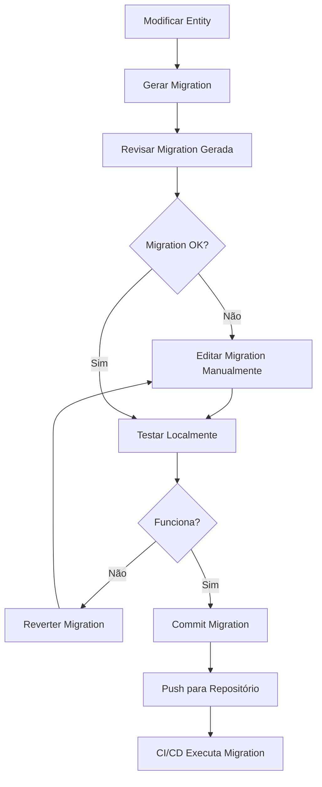
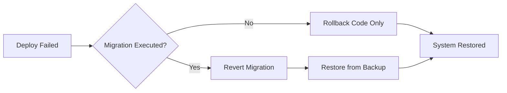

# 🗄️ Database

## Stack

- **PostgreSQL** >= 14.0
- **TypeORM** - ORM com suporte completo a migrations e relacionamentos
- **Migrations** - Versionamento automático do schema
- **Seeds** - Dados iniciais para desenvolvimento

---

## TypeORM CLI

### Scripts Disponíveis

```bash
# Gerar nova migration baseada nas mudanças das entities
yarn migration:generate --name=CreateProductTable

# Executar migrations pendentes
yarn migration:run

# Reverter última migration
yarn migration:revert

# Mostrar status das migrations
yarn migration:show

# Executar seeds
yarn seed
```

---

## Migrations

As migrations são geradas automaticamente pelo TypeORM baseadas nas mudanças das entities.

### Estrutura de Diretório

```
apps/api/src/database/
├── migrations/
│   ├── 1710501234567-CreateCategoryTable.ts
│   ├── 1710501298765-CreateProductTable.ts
│   ├── 1710501367890-CreateStockTable.ts
│   ├── 1710501456789-CreateOrderTable.ts
│   └── 1710501523456-CreateOrderItemTable.ts
└── data-source.ts
```

---

### Naming Convention

```
{timestamp}-{ActionEntityTable}.ts

Padrões:
- Create{Entity}Table
- Add{Column}To{Entity}
- Create{Index}On{Entity}
- Add{Constraint}To{Entity}
- Rename{OldName}To{NewName}In{Entity}

Exemplos:
1710501234567-CreateProductTable.ts
1710501298765-AddCategoryIdToProduct.ts
1710501367890-CreateIndexOnProductName.ts
1710501456789-AddUniqueConstraintToOrderNumber.ts
1710501523456-RenameDescriptionToDetailsInProduct.ts
```

---

### Exemplo Completo de Migration

```typescript
// apps/api/src/database/migrations/1710501234567-CreateProductTable.ts
import { MigrationInterface, QueryRunner, Table, TableForeignKey, TableIndex } from 'typeorm';

export class CreateProductTable1710501234567 implements MigrationInterface {
  public async up(queryRunner: QueryRunner): Promise<void> {
    // Criar tabela
    await queryRunner.createTable(
      new Table({
        name: 'products',
        columns: [
          {
            name: 'id',
            type: 'uuid',
            isPrimary: true,
            default: 'uuid_generate_v4()',
          },
          {
            name: 'name',
            type: 'varchar',
            length: '200',
            isNullable: false,
          },
          {
            name: 'description',
            type: 'text',
            isNullable: true,
          },
          {
            name: 'price',
            type: 'decimal',
            precision: 10,
            scale: 2,
            isNullable: false,
          },
          {
            name: 'category_id',
            type: 'uuid',
            isNullable: false,
          },
          {
            name: 'is_active',
            type: 'boolean',
            default: true,
          },
          {
            name: 'created_at',
            type: 'timestamp',
            default: 'now()',
          },
          {
            name: 'updated_at',
            type: 'timestamp',
            default: 'now()',
          },
          {
            name: 'deleted_at',
            type: 'timestamp',
            isNullable: true,
          },
        ],
      }),
      true
    );

    // Adicionar foreign key
    await queryRunner.createForeignKey(
      'products',
      new TableForeignKey({
        columnNames: ['category_id'],
        referencedColumnNames: ['id'],
        referencedTableName: 'categories',
        onDelete: 'RESTRICT',
        onUpdate: 'CASCADE',
      })
    );

    // Adicionar índice
    await queryRunner.createIndex(
      'products',
      new TableIndex({
        name: 'IDX_PRODUCT_CATEGORY',
        columnNames: ['category_id'],
      })
    );

    // Adicionar índice único composto
    await queryRunner.createIndex(
      'products',
      new TableIndex({
        name: 'IDX_PRODUCT_NAME_CATEGORY',
        columnNames: ['name', 'category_id'],
        isUnique: true,
      })
    );

    // Adicionar check constraint
    await queryRunner.query(
      `ALTER TABLE products ADD CONSTRAINT CHK_PRODUCT_PRICE_POSITIVE CHECK (price > 0)`
    );
  }

  public async down(queryRunner: QueryRunner): Promise<void> {
    // Remover check constraint
    await queryRunner.query(
      `ALTER TABLE products DROP CONSTRAINT CHK_PRODUCT_PRICE_POSITIVE`
    );

    // Remover índices
    await queryRunner.dropIndex('products', 'IDX_PRODUCT_NAME_CATEGORY');
    await queryRunner.dropIndex('products', 'IDX_PRODUCT_CATEGORY');

    // Remover foreign key
    const table = await queryRunner.getTable('products');
    const foreignKey = table.foreignKeys.find(
      fk => fk.columnNames.indexOf('category_id') !== -1
    );
    await queryRunner.dropForeignKey('products', foreignKey);

    // Remover tabela
    await queryRunner.dropTable('products');
  }
}
```

---

### Exemplo de Migration de Alteração

```typescript
// apps/api/src/database/migrations/1710501589012-AddMinimumQuantityToStock.ts
import { MigrationInterface, QueryRunner, TableColumn } from 'typeorm';

export class AddMinimumQuantityToStock1710501589012 implements MigrationInterface {
  public async up(queryRunner: QueryRunner): Promise<void> {
    await queryRunner.addColumn(
      'stock',
      new TableColumn({
        name: 'minimum_quantity',
        type: 'integer',
        default: 0,
        isNullable: false,
      })
    );

    // Adicionar check constraint
    await queryRunner.query(
      `ALTER TABLE stock ADD CONSTRAINT CHK_STOCK_MIN_QTY_POSITIVE CHECK (minimum_quantity >= 0)`
    );
  }

  public async down(queryRunner: QueryRunner): Promise<void> {
    await queryRunner.query(
      `ALTER TABLE stock DROP CONSTRAINT CHK_STOCK_MIN_QTY_POSITIVE`
    );
    
    await queryRunner.dropColumn('stock', 'minimum_quantity');
  }
}
```

---

### Fluxo de Trabalho com Migrations



---

## Seeds

Seeds populam o banco com dados iniciais para desenvolvimento e testes.

### Estrutura de Diretório

```
apps/api/src/database/seeds/
├── index.ts
├── category.seed.ts
└── product.seed.ts
```

---

### Exemplo: Category Seed

```typescript
// apps/api/src/database/seeds/category.seed.ts
import { DataSource } from 'typeorm';
import { Category } from '@domain/entities/category.entity';

export async function seedCategories(dataSource: DataSource): Promise<void> {
  const repository = dataSource.getRepository(Category);

  const categories = [
    {
      name: 'Bebidas',
      description: 'Refrigerantes, sucos e águas',
      isActive: true,
    },
    {
      name: 'Snacks',
      description: 'Salgadinhos e petiscos',
      isActive: true,
    },
    {
      name: 'Laticínios',
      description: 'Leite, queijos e derivados',
      isActive: true,
    },
    {
      name: 'Higiene',
      description: 'Produtos de limpeza e higiene pessoal',
      isActive: true,
    },
    {
      name: 'Mercearia',
      description: 'Arroz, feijão, massas e enlatados',
      isActive: true,
    },
  ];

  for (const categoryData of categories) {
    const exists = await repository.findOne({ 
      where: { name: categoryData.name } 
    });
    
    if (!exists) {
      const category = repository.create(categoryData);
      await repository.save(category);
      console.log(`✅ Category created: ${categoryData.name}`);
    } else {
      console.log(`⏭️  Category already exists: ${categoryData.name}`);
    }
  }

  console.log('✅ Categories seeded successfully');
}
```

---

### Exemplo: Product Seed

```typescript
// apps/api/src/database/seeds/product.seed.ts
import { DataSource } from 'typeorm';
import { Product } from '@domain/entities/product.entity';
import { Category } from '@domain/entities/category.entity';
import { Stock } from '@domain/entities/stock.entity';

export async function seedProducts(dataSource: DataSource): Promise<void> {
  const productRepository = dataSource.getRepository(Product);
  const categoryRepository = dataSource.getRepository(Category);
  const stockRepository = dataSource.getRepository(Stock);

  // Buscar categorias
  const beverageCategory = await categoryRepository.findOne({ 
    where: { name: 'Bebidas' } 
  });
  const snackCategory = await categoryRepository.findOne({ 
    where: { name: 'Snacks' } 
  });

  if (!beverageCategory || !snackCategory) {
    console.error('❌ Categories not found. Run category seed first.');
    return;
  }

  const products = [
    {
      name: 'Coca-Cola 2L',
      description: 'Refrigerante de cola',
      price: 8.50,
      categoryId: beverageCategory.id,
      isActive: true,
      stockQuantity: 45,
      stockMinimum: 10,
    },
    {
      name: 'Guaraná Antarctica 2L',
      description: 'Refrigerante de guaraná',
      price: 7.50,
      categoryId: beverageCategory.id,
      isActive: true,
      stockQuantity: 30,
      stockMinimum: 8,
    },
    {
      name: 'Salgadinho Doritos',
      description: 'Salgadinho sabor queijo',
      price: 5.99,
      categoryId: snackCategory.id,
      isActive: true,
      stockQuantity: 60,
      stockMinimum: 15,
    },
  ];

  for (const productData of products) {
    const { stockQuantity, stockMinimum, ...productInfo } = productData;
    
    const exists = await productRepository.findOne({
      where: { 
        name: productInfo.name,
        categoryId: productInfo.categoryId
      }
    });

    if (!exists) {
      // Criar produto
      const product = productRepository.create(productInfo);
      await productRepository.save(product);

      // Criar estoque
      const stock = stockRepository.create({
        productId: product.id,
        quantity: stockQuantity,
        minimumQuantity: stockMinimum,
        lastUpdatedAt: new Date(),
      });
      await stockRepository.save(stock);

      console.log(`✅ Product created: ${productInfo.name}`);
    } else {
      console.log(`⏭️  Product already exists: ${productInfo.name}`);
    }
  }

  console.log('✅ Products seeded successfully');
}
```

---

### Arquivo Index dos Seeds

```typescript
// apps/api/src/database/seeds/index.ts
import { DataSource } from 'typeorm';
import { seedCategories } from './category.seed';
import { seedProducts } from './product.seed';

export async function runSeeds(dataSource: DataSource): Promise<void> {
  console.log('🌱 Starting database seeding...\n');

  try {
    // Ordem importa! Categorias antes de produtos
    await seedCategories(dataSource);
    await seedProducts(dataSource);

    console.log('\n🎉 All seeds completed successfully!');
  } catch (error) {
    console.error('❌ Error running seeds:', error);
    throw error;
  }
}
```

---

### Executar Seeds

```bash
# Executar todos os seeds
yarn seed

# Executar seed específico (configurar script no package.json)
yarn seed:categories
yarn seed:products
```

---

## Estratégias de Versionamento

### Ambientes

```
development    → Migrations + Seeds
staging        → Migrations only (dados de teste via API)
production     → Migrations only (dados reais)
```

### Rollback Strategy



---

## Backup e Restore

### Backup Automático (Docker)

```bash
# Backup
docker exec cornershop-db pg_dump -U postgres cornershop > backup_$(date +%Y%m%d_%H%M%S).sql

# Restore
docker exec -i cornershop-db psql -U postgres cornershop < backup_20260315_150000.sql
```

---

## Boas Práticas

### ✅ DO

- ✅ Sempre revisar migrations geradas automaticamente
- ✅ Testar migrations em ambiente local antes de commitar
- ✅ Escrever migrations reversíveis (`up` e `down`)
- ✅ Usar transactions em migrations complexas
- ✅ Adicionar índices para colunas frequentemente consultadas
- ✅ Documentar migrations complexas com comentários
- ✅ Manter seeds idempotentes (verificar se já existe)

### ❌ DON'T

- ❌ Editar migrations já executadas em produção
- ❌ Fazer migrations destrutivas sem backup
- ❌ Commitar migrations sem testar rollback
- ❌ Misturar mudanças de schema com mudanças de dados
- ❌ Usar seeds em produção
- ❌ Fazer migrations muito grandes (dividir em partes)

---

## Configuração do DataSource

```typescript
// apps/api/src/database/data-source.ts
import { DataSource } from 'typeorm';

export const AppDataSource = new DataSource({
  type: 'postgres',
  host: process.env.DB_HOST || 'localhost',
  port: parseInt(process.env.DB_PORT) || 5432,
  username: process.env.DB_USERNAME || 'postgres',
  password: process.env.DB_PASSWORD || 'postgres',
  database: process.env.DB_DATABASE || 'cornershop',
  entities: ['libs/domain/src/entities/**/*.entity.ts'],
  migrations: ['apps/api/src/database/migrations/**/*.ts'],
  synchronize: false, // NUNCA true em produção
  logging: process.env.NODE_ENV === 'development',
  ssl: process.env.NODE_ENV === 'production' ? { rejectUnauthorized: false } : false,
});
```

---

[⬆ Voltar para README](../README.md)
