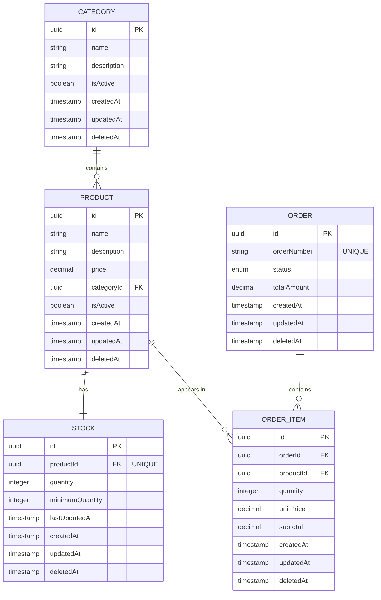
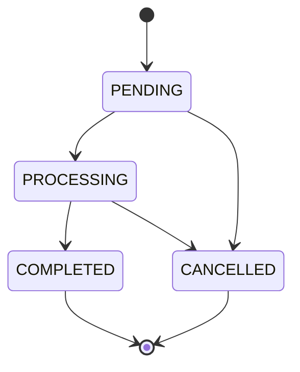
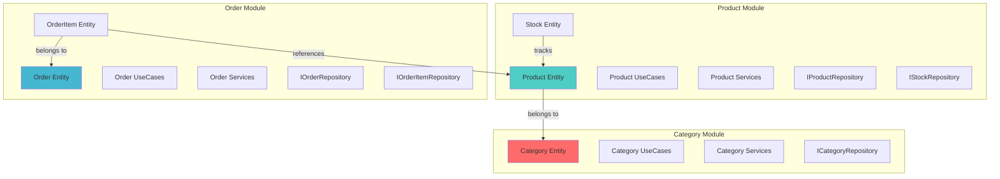

# 📊 Modelo de Domínio

## Diagrama de Relacionamentos (ER)



---

## Entidades Detalhadas

### 1️⃣ Category (Categoria)

Organiza produtos em categorias para facilitar navegação e filtragem.

#### Interface TypeScript

```typescript
interface Category {
  id: string;                    // UUID
  name: string;                  // Nome da categoria
  description?: string;          // Descrição opcional
  isActive: boolean;             // Se a categoria está ativa
  createdAt: Date;
  updatedAt: Date;
  deletedAt?: Date;              // Soft delete
  
  // Relacionamentos
  products: Product[];           // 1:N
}
```

#### Regras de Negócio

- ✅ Nome deve ser único (case-insensitive)
- ✅ Categorias inativas não aparecem em listagens públicas
- ✅ Ao deletar (soft), produtos associados permanecem
- ✅ `isActive = false` oculta a categoria, mas não afeta produtos

#### Validações

- **name**: obrigatório, 2-100 caracteres
- **description**: opcional, máximo 500 caracteres
- **isActive**: padrão `true`

---

### 2️⃣ Product (Produto)

Representa os produtos vendidos na loja.

#### Interface TypeScript

```typescript
interface Product {
  id: string;                    // UUID
  name: string;                  // Nome do produto
  description?: string;          // Descrição opcional
  price: number;                 // Preço unitário (decimal)
  categoryId: string;            // FK para Category
  isActive: boolean;             // Se o produto está ativo
  createdAt: Date;
  updatedAt: Date;
  deletedAt?: Date;              // Soft delete
  
  // Relacionamentos
  category: Category;            // N:1
  stock: Stock;                  // 1:1
  orderItems: OrderItem[];       // 1:N
}
```

#### Regras de Negócio

- ✅ Preço deve ser maior que zero
- ✅ Produtos inativos não podem ser adicionados a novos pedidos
- ✅ Ao criar produto, estoque é criado automaticamente com quantidade 0
- ✅ Nome + CategoryId devem ser únicos juntos
- ✅ Ao deletar (soft), o produto não aparece em listagens mas permanece em pedidos antigos

#### Validações

- **name**: obrigatório, 2-200 caracteres
- **description**: opcional, máximo 1000 caracteres
- **price**: obrigatório, > 0, decimal(10,2)
- **categoryId**: obrigatório, UUID válido
- **isActive**: padrão `true`

---

### 3️⃣ Stock (Estoque)

Controla a quantidade disponível de cada produto.

#### Interface TypeScript

```typescript
interface Stock {
  id: string;                    // UUID
  productId: string;             // FK para Product (UNIQUE)
  quantity: number;              // Quantidade atual
  minimumQuantity: number;       // Estoque mínimo (alerta)
  lastUpdatedAt: Date;           // Última atualização de quantidade
  createdAt: Date;
  updatedAt: Date;
  deletedAt?: Date;              // Soft delete
  
  // Relacionamentos
  product: Product;              // 1:1
}
```

#### Regras de Negócio

- ✅ Quantidade não pode ser negativa
- ✅ Ao processar pedido, quantidade é decrementada automaticamente
- ✅ Se `quantity < minimumQuantity`, deve gerar alerta (futuro)
- ✅ `lastUpdatedAt` é atualizado sempre que quantity muda
- ✅ Cada produto tem apenas um registro de estoque (relação 1:1)
- ✅ Estoque é criado automaticamente ao criar produto

#### Validações

- **quantity**: obrigatório, >= 0, inteiro
- **minimumQuantity**: obrigatório, >= 0, inteiro, padrão 0
- **productId**: obrigatório, UUID válido, único

---

### 4️⃣ Order (Pedido)

Representa um pedido realizado na loja.

#### Enum: OrderStatus

```typescript
enum OrderStatus {
  PENDING = 'PENDING',           // Aguardando processamento
  PROCESSING = 'PROCESSING',     // Em processamento
  COMPLETED = 'COMPLETED',       // Concluído
  CANCELLED = 'CANCELLED'        // Cancelado
}
```

#### Interface TypeScript

```typescript
interface Order {
  id: string;                    // UUID
  orderNumber: string;           // Número do pedido (único, gerado)
  status: OrderStatus;           // Status atual
  totalAmount: number;           // Valor total (decimal)
  createdAt: Date;
  updatedAt: Date;
  deletedAt?: Date;              // Soft delete
  
  // Relacionamentos
  items: OrderItem[];            // 1:N
}
```

#### Regras de Negócio

- ✅ `orderNumber` é gerado automaticamente (formato: `ORD-{timestamp}-{random}`)
- ✅ Status inicial é sempre `PENDING`
- ✅ `totalAmount` é calculado pela soma dos subtotais dos items
- ✅ Pedidos em `COMPLETED` ou `CANCELLED` não podem ser modificados
- ✅ Transição de status segue fluxo: **PENDING → PROCESSING → COMPLETED**
- ✅ **CANCELLED** pode vir de **PENDING** ou **PROCESSING**
- ✅ Ao criar pedido, estoque dos produtos é decrementado

#### Fluxo de Status



#### Validações

- **orderNumber**: gerado automaticamente, único
- **status**: obrigatório, enum OrderStatus
- **totalAmount**: calculado, >= 0, decimal(10,2)
- **items**: obrigatório, array com pelo menos 1 item

---

### 5️⃣ OrderItem (Item do Pedido)

Representa cada produto dentro de um pedido.

#### Interface TypeScript

```typescript
interface OrderItem {
  id: string;                    // UUID
  orderId: string;               // FK para Order
  productId: string;             // FK para Product
  quantity: number;              // Quantidade do produto
  unitPrice: number;             // Preço unitário no momento do pedido
  subtotal: number;              // quantity * unitPrice
  createdAt: Date;
  updatedAt: Date;
  deletedAt?: Date;              // Soft delete
  
  // Relacionamentos
  order: Order;                  // N:1
  product: Product;              // N:1
}
```

#### Regras de Negócio

- ✅ Quantidade deve ser maior que zero
- ✅ `unitPrice` captura o preço do produto no momento da criação do pedido (snapshot)
- ✅ `subtotal` é calculado automaticamente: `quantity * unitPrice`
- ✅ Ao criar item, valida se há estoque suficiente
- ✅ Ao processar pedido, estoque é decrementado
- ✅ Preço congelado: mudanças futuras no preço do produto não afetam pedidos antigos

#### Validações

- **orderId**: obrigatório, UUID válido
- **productId**: obrigatório, UUID válido
- **quantity**: obrigatório, > 0, inteiro
- **unitPrice**: obrigatório, > 0, decimal(10,2)
- **subtotal**: calculado automaticamente

---

## Características Comuns

Todas as entidades compartilham:

✅ **Soft Delete** - `deletedAt` permite "deletar" sem perder dados  
✅ **Auditoria** - `createdAt` e `updatedAt` para rastreabilidade  
✅ **UUID** - Identificadores universalmente únicos  
✅ **TypeORM Decorators** - Mapeamento ORM completo

---

## Diagrama de Módulos do Domínio



---

## Glossário de Termos do Domínio

| Termo | Definição |
|-------|-----------|
| **Category** | Agrupamento lógico de produtos similares |
| **Product** | Item vendável na loja com preço e estoque |
| **Stock** | Quantidade disponível de um produto específico |
| **Order** | Conjunto de produtos solicitados em uma compra |
| **OrderItem** | Linha individual dentro de um pedido |
| **Soft Delete** | Marcação lógica de exclusão sem remover fisicamente |
| **Snapshot** | Captura de valor em momento específico (ex: preço no pedido) |
| **minimumQuantity** | Limite mínimo de estoque para alerta |
| **orderNumber** | Identificador único legível do pedido |

---

## Constraints do Banco de Dados

### Unique Constraints
- `categories.name` (unique, case-insensitive)
- `products.name + products.categoryId` (unique together)
- `stock.productId` (unique)
- `orders.orderNumber` (unique)

### Foreign Keys
- `products.categoryId` → `categories.id`
- `stock.productId` → `products.id`
- `order_items.orderId` → `orders.id`
- `order_items.productId` → `products.id`

### Check Constraints
- `products.price > 0`
- `stock.quantity >= 0`
- `stock.minimumQuantity >= 0`
- `order_items.quantity > 0`
- `order_items.unitPrice > 0`
- `orders.totalAmount >= 0`

---

[⬆ Voltar para README](../README.md)
