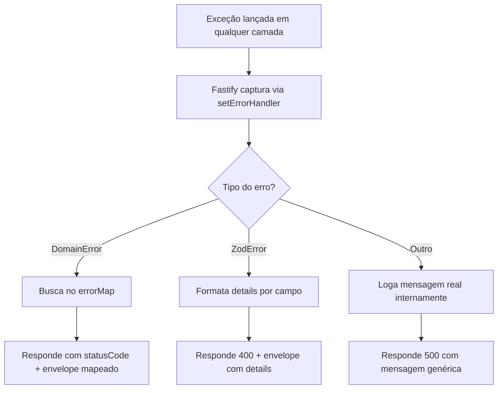

# ⚠️ Tratamento de Erros — Contrato e Mecanismo

Scope: documentação técnica para engenheiros backend responsáveis por implementar e manter o handler global de erros na API Fastify.

Resumo executivo
-----------------
Esta documentação descreve o contrato de erros da API (envelope), a classificação de exceções, a hierarquia de erros de domínio, o comportamento do handler global do Fastify e o fluxo desde o lançamento até a resposta HTTP. Segue as decisões registradas em [docs/adr/0001-idioma-mensagens-de-erro.md](adr/0001-idioma-mensagens-de-erro.md) e [docs/adr/0002-error-handler-centralizado.md](adr/0002-error-handler-centralizado.md).

Objetivos
---------
- Definir um envelope de erro uniforme para todos os endpoints.
- Mapear erros de domínio para códigos HTTP apropriados via um `errorMap` central.
- Regras claras para erros de validação (Zod).
- Orientar desenvolvedores sobre como adicionar novos erros de domínio.

Não-goals
--------
- Não cobre implementação de i18n (fora do escopo; ver ADR-0001).
- Não contém código de produção — apenas pseudo-código e exemplos de payload.

Contexto e suposições
---------------------
- Projeto: Fastify + TypeScript em NX monorepo, DDD + Clean Architecture.
- Mensagens legíveis ao usuário em pt-BR (ADR-0001). O campo `error` é um identificador em inglês.
- Há um handler global via `fastify.setErrorHandler` (ADR-0002).
- Assumo que os exemplos de payload em `docs/api-endpoints.md` são canônicos e devem ser reutilizados.

1. Visão Geral
---------------
A API usa um error handler global centralizado no Fastify que classifica, formata e responde erros de forma uniforme em todos os endpoints. O handler traduz exceções do domínio e erros de validação em envelopes JSON padronizados e aplica o status HTTP apropriado. (Veja também ADR-0002 para a decisão arquitetural.)

2. Envelope de Erro
-------------------
Definição dos dois formatos de resposta de erro suportados pelo handler:

- Erros de negócio/infra (domínio + genérico)

```json
{
  "error": "NomeDaExcecao",
  "message": "Mensagem legível em português"
}
```

- Erros de validação (Zod)

```json
{
  "error": "ValidationError",
  "message": "Dados inválidos",
  "details": [
    {
      "field": "items[0].quantity",
      "message": "Deve ser um número inteiro positivo"
    }
  ]
}
```

Regras do envelope
- `error`: sempre em inglês (identificador técnico — ex: `ProductNotFoundException`).
- `message`: sempre em português (pt-BR) — texto legível para humanos conforme ADR-0001.
- `details`: presente apenas em erros de validação; array com objetos { field, message }.
- `statusCode` não é incluído no body — o código HTTP é enviado apenas no header.
- Nenhum stack trace ou detalhe interno é exposto ao cliente em erros não mapeados.

3. Classificação de Erros
-------------------------
O handler classifica erros em 3 categorias principais:

| Categoria | Origem | Formato | Exemplo |
|-----------|--------|---------|---------|
| Erro de Domínio | `DomainError` (classe base) | `{ error, message }` | `ProductNotFoundException` |
| Erro de Validação | `ZodError` | `{ error, message, details[] }` | Campos inválidos no body |
| Erro Genérico | Qualquer outro | `{ error, message }` genérico | Erro inesperado de infra |

4. Tabela de Erros de Domínio (primeira etapa)
------------------------------------------------
Tabela com as exceções de domínio mapeadas inicialmente:

| Classe | HTTP Status | `error` | `message` |
|--------|-------------|---------|-----------|
| `ProductNotFoundException` | 404 | `ProductNotFoundException` | "Produto não encontrado" |
| `CategoryNotFoundException` | 404 | `CategoryNotFoundException` | "Categoria não encontrada" |
| `InsufficientStockError` | 400 | `InsufficientStockError` | "Estoque insuficiente para o produto {nome}" |
| `OrderNotFoundException` | 404 | `OrderNotFoundException` | "Pedido não encontrado" |
| `ZodError` | 400 | `ValidationError` | "Dados inválidos" |
| Erro genérico | 500 | `InternalServerError` | "Erro interno do servidor" |

Observação: mensagens devem usar templates quando apropriado (ex: incluir `{nome}`) e os valores concretos podem ser retornados apenas em campos documentados — evite expor dados sensíveis.

5. Hierarquia de Erros de Domínio
---------------------------------
Exemplo em pseudo-código TypeScript ilustrativo (apenas para referência implementacional):

```typescript
// libs/domain/src/errors/
// Pseudo-código ilustrativo

// Classe base — todos os erros de domínio herdam desta
class DomainError extends Error {
  constructor(message: string) { ... }
}

// Erros concretos da primeira etapa
class ProductNotFoundException extends DomainError { ... }
class CategoryNotFoundException extends DomainError { ... }
class InsufficientStockError extends DomainError {
  // Carrega contexto adicional: nome do produto, disponível, solicitado
}
class OrderNotFoundException extends DomainError { ... }
```

Localização sugerida dos arquivos:

```
libs/domain/src/errors/
├── domain.error.ts                  # Classe base
├── product-not-found.error.ts
├── category-not-found.error.ts
├── insufficient-stock.error.ts
└── order-not-found.error.ts
```

6. Como o Handler Global Funciona
---------------------------------
Diagrama do fluxo do erro desde o lançamento até a resposta HTTP:



Explicação dos caminhos
- DomainError: o handler consulta um `errorMap` que mapeia a classe do erro para status HTTP, `error` (nome) e `message` (pt-BR). Retorna o envelope sem stack trace.
- ZodError: transforma `ZodError.issues` em `details: [{ field, message }]` e responde com `400` e `error: ValidationError`.
- Outro (não mapeado): o handler faz logging com nível `error` e inclui stack trace nos logs internos via `request.log.error(err)`; a resposta ao cliente é `500` com `InternalServerError` e mensagem genérica.

7. Exemplos de Resposta por Cenário
----------------------------------
Usamos os exemplos presentes em `docs/api-endpoints.md` quando aplicável.

Produto não encontrado (404)

Request:
```http
GET /api/products/00000000-0000-0000-0000-000000000000
```

Response 404:
```json
{
  "error": "ProductNotFoundException",
  "message": "Produto não encontrado"
}
```

Estoque insuficiente (400)

Request (criar pedido):
```json
{
  "items": [
    { "productId": "323e4567-e89b-12d3-a456-426614174002", "quantity": 2 }
  ]
}
```

Response 400:
```json
{
  "error": "InsufficientStockError",
  "message": "Estoque insuficiente para o produto Coca-Cola 2L"
}
```

Validação de input (400 com details)

Request (criar pedido com body vazio):
```json
{}
```

Response 400:
```json
{
  "error": "ValidationError",
  "message": "Dados inválidos",
  "details": [
    { "field": "items", "message": "items must contain at least 1 item" }
  ]
}
```

Erro interno (500)

Request: qualquer request que provoque um erro não mapeado (ex: falha de infra inesperada)

Response 500:
```json
{
  "error": "InternalServerError",
  "message": "Erro interno do servidor"
}
```

8. Como Adicionar um Novo Erro de Domínio
-----------------------------------------
Passos que um desenvolvedor deve seguir:

1. Criar a classe em `libs/domain/src/errors/` herdando de `DomainError`.
2. Definir a mensagem em português no construtor (usar mensagens centralizadas quando possível).
3. Adicionar a entrada no `errorMap` em `apps/api/src/plugins/error-handler.plugin.ts` (mapeie status, `error` e `message`).
4. Documentar a nova exceção na tabela da seção 4 deste documento (atualizar versão/changelog).

9. Logging de Erros
-------------------
- Erros de domínio mapeados: não são logados (fluxos esperados). Caso queira contexto, usar `request.log.debug` opcionalmente.
- Erros de validação: não são logados (são responsabilidade do cliente).
- Erros não mapeados: são logados com nível `error` usando `request.log.error(err)` e incluem stack trace interno — porém **nunca** expostos na response.

Recomendações práticas
- Incluir identificadores correlacionados (ex: requestId) em logs para rastreabilidade.
- Emitir métricas: contador de erros por tipo (mapped / validation / generic) e latência/time-to-first-error.

10. Referências e ADRs
---------------------
- ADR-0001: [docs/adr/0001-idioma-mensagens-de-erro.md](adr/0001-idioma-mensagens-de-erro.md)
- ADR-0002: [docs/adr/0002-error-handler-centralizado.md](adr/0002-error-handler-centralizado.md)
- Exemplos de endpoints: [docs/api-endpoints.md](api-endpoints.md)

Verification checklist
----------------------
1. Terminologia consistente: verifique que `DomainError`, `ValidationError`, `InternalServerError` aparecem nos diagramas e no texto (PASS)
2. Diagram-text parity: todos os componentes do diagrama estão descritos (PASS)
3. Schema examples validate: exemplos seguem os shapes declarados (PASS)
4. Migration plan completeness: instruções para adicionar novos erros incluídas (PASS)
5. Security & compliance: authz/authn não afetados; evitar exposição de dados sensíveis (PASS)
6. Performance targets: assumir throughput médio; recomendo monitorar erros por tipo (TODO: adicionar metas específicas)

Remediações / Assunções não resolvidas
- Adicionar metas de performance e SLOs (assumidas fora do escopo atual) — AÇÃO: definir com SRE/Product.

Changelog
---------
- 2026-03-23: Criação inicial do documento com contrato de erros, exemplos e instruções de implementação.

TODO / Ações
-----------
- [ ] Adicionar validação automática de schemas de erro em CI (owner: infra eng, prioridade: medium)
- [ ] Implementar métricas e dashboards para erro-métricas (owner: SRE, prioridade: medium)

[⬆ Voltar para README](../README.md)
