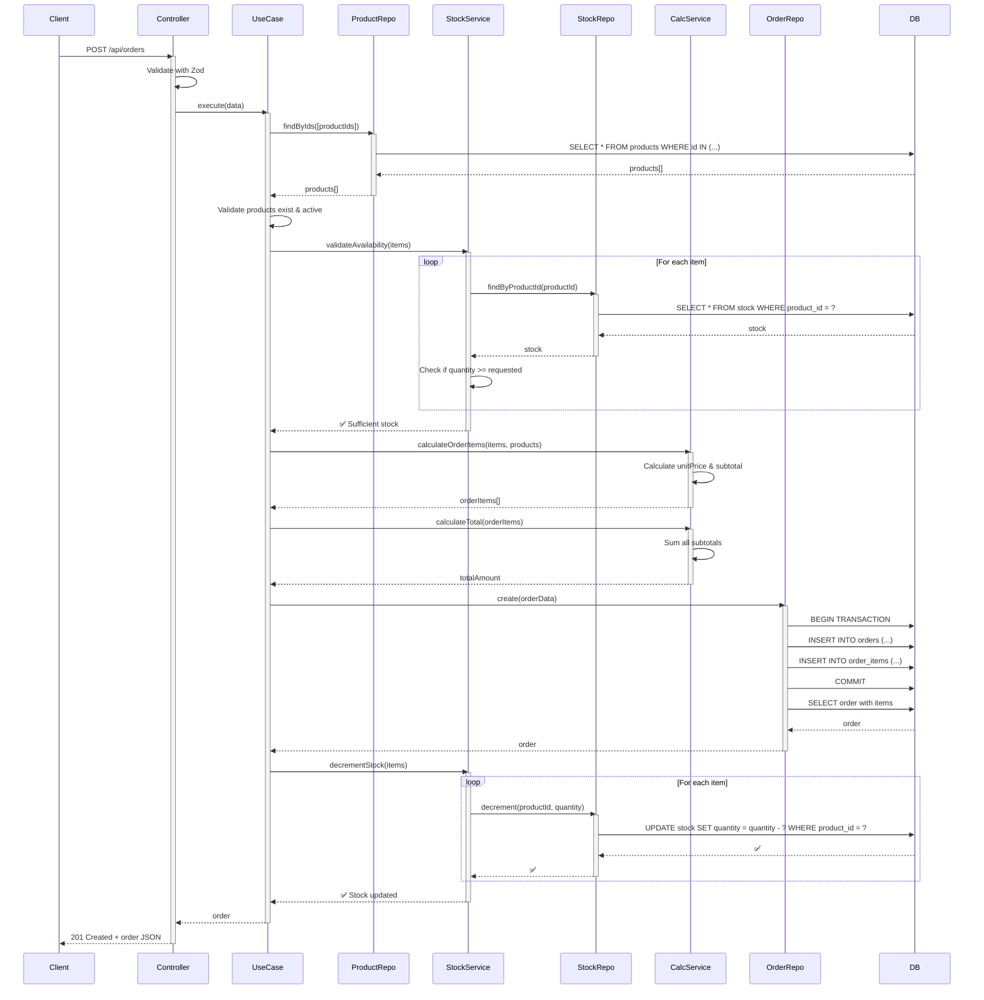
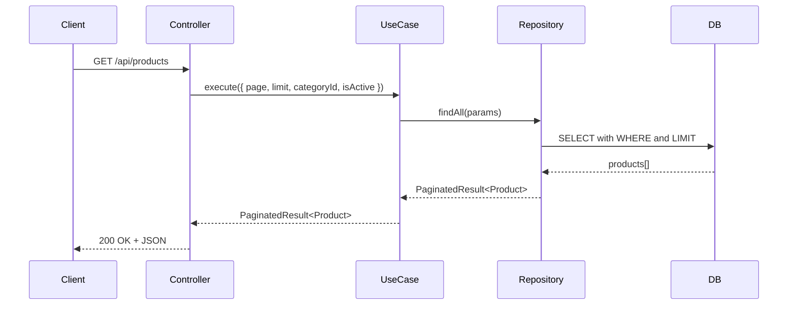
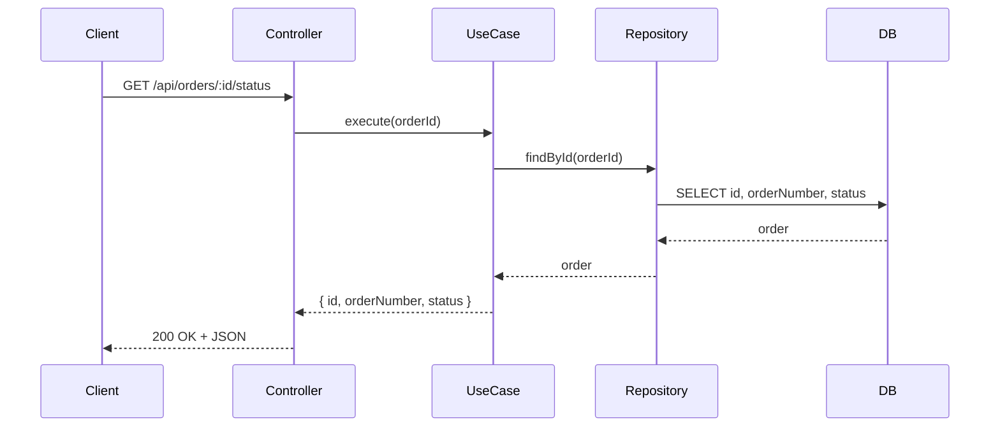
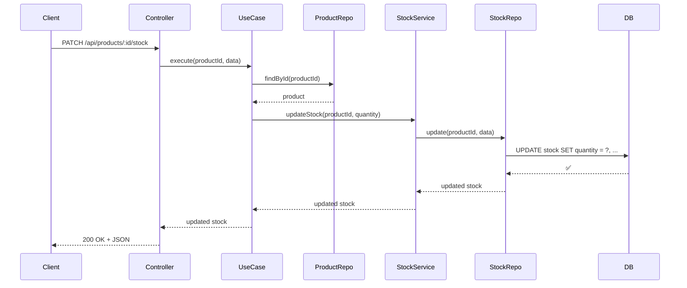

# 🔄 Exemplos de Fluxo Completo

## 1. Criar Pedido (CreateOrder)

Vamos ilustrar um fluxo completo de **criação de pedido**, mostrando como todas as camadas interagem.

---

### 1️⃣ Request HTTP

```http
POST /api/orders HTTP/1.1
Host: localhost:3000
Content-Type: application/json

{
  "items": [
    {
      "productId": "323e4567-e89b-12d3-a456-426614174002",
      "quantity": 2
    },
    {
      "productId": "423e4567-e89b-12d3-a456-426614174003",
      "quantity": 1
    }
  ]
}
```

---

### 2️⃣ Controller (Apresentação)

```typescript
// apps/api/src/controllers/order.controller.ts
import { FastifyRequest, FastifyReply } from 'fastify';
import { inject, injectable } from 'tsyringe';
import { ICreateOrderUseCase } from '@domain/orders/use-cases/create-order.usecase';
import { createOrderSchema } from '../schemas/order.schema';

@injectable()
export class OrderController {
  constructor(
    @inject('CreateOrderUseCase') 
    private createOrderUseCase: ICreateOrderUseCase
  ) {}

  async create(
    request: FastifyRequest,
    reply: FastifyReply
  ) {
    try {
      // 1. Valida request com Zod
      const body = createOrderSchema.parse(request.body);
      
      // 2. Delega para UseCase
      const order = await this.createOrderUseCase.execute(body);
      
      // 3. Retorna resposta HTTP
      return reply.code(201).send(order);
    } catch (error) {
      // 4. Tratamento de erro
      if (error instanceof InsufficientStockError) {
        return reply.code(400).send({
          error: error.message,
          available: error.available,
          requested: error.requested,
        });
      }
      
      throw error;
    }
  }
}
```

---

### 3️⃣ UseCase (Orquestração)

```typescript
// libs/domain/src/orders/use-cases/create-order.usecase.ts
import { injectable, inject } from 'tsyringe';
import { IOrderRepository } from '@domain/repositories/order.repository';
import { IProductRepository } from '@domain/repositories/product.repository';
import { StockService } from '@domain/stock/services/stock-management.service';
import { OrderCalculationService } from '../services/order-calculation.service';
import { Order } from '@domain/entities/order.entity';
import { OrderStatus } from '@domain/enums/order-status.enum';

export interface CreateOrderData {
  items: {
    productId: string;
    quantity: number;
  }[];
}

@injectable()
export class CreateOrderUseCase {
  constructor(
    @inject('IOrderRepository') 
    private orderRepository: IOrderRepository,
    @inject('IProductRepository') 
    private productRepository: IProductRepository,
    @inject('StockService') 
    private stockService: StockService,
    @inject('OrderCalculationService') 
    private orderCalculationService: OrderCalculationService
  ) {}

  async execute(data: CreateOrderData): Promise<Order> {
    // 1. Valida se produtos existem e estão ativos
    const productIds = data.items.map(i => i.productId);
    const products = await this.productRepository.findByIds(productIds);

    if (products.length !== productIds.length) {
      throw new ProductNotFoundException('One or more products not found');
    }

    const inactiveProducts = products.filter(p => !p.isActive);
    if (inactiveProducts.length > 0) {
      throw new InactiveProductError(inactiveProducts[0].id);
    }

    // 2. Valida estoque disponível
    await this.stockService.validateAvailability(data.items);

    // 3. Calcula valores dos items
    const orderItems = this.orderCalculationService.calculateOrderItems(
      data.items,
      products
    );

    // 4. Calcula total do pedido
    const totalAmount = this.orderCalculationService.calculateTotal(orderItems);

    // 5. Cria pedido (em transação)
    const order = await this.orderRepository.create({
      items: orderItems,
      totalAmount,
      status: OrderStatus.PENDING,
    });

    // 6. Atualiza estoque (decrementa)
    await this.stockService.decrementStock(data.items);

    return order;
  }
}
```

---

### 4️⃣ Services (Lógica de Negócio)

#### StockService

```typescript
// libs/domain/src/stock/services/stock-management.service.ts
import { injectable, inject } from 'tsyringe';
import { IStockRepository } from '@domain/repositories/stock.repository';
import { InsufficientStockError } from '../errors/insufficient-stock.error';

interface OrderItemInput {
  productId: string;
  quantity: number;
}

@injectable()
export class StockService {
  constructor(
    @inject('IStockRepository') 
    private stockRepository: IStockRepository
  ) {}

  /**
   * Validates if there's sufficient stock for all items
   * @throws InsufficientStockError if any item has insufficient stock
   */
  async validateAvailability(items: OrderItemInput[]): Promise<void> {
    for (const item of items) {
      const stock = await this.stockRepository.findByProductId(item.productId);
      
      if (!stock) {
        throw new StockNotFoundException(item.productId);
      }
      
      if (stock.quantity < item.quantity) {
        throw new InsufficientStockError(
          item.productId,
          stock.quantity,
          item.quantity
        );
      }
    }
  }

  /**
   * Decrements stock for all items in the order
   */
  async decrementStock(items: OrderItemInput[]): Promise<void> {
    for (const item of items) {
      await this.stockRepository.decrement(item.productId, item.quantity);
    }
  }
}
```

#### OrderCalculationService

```typescript
// libs/domain/src/orders/services/order-calculation.service.ts
import { injectable } from 'tsyringe';
import { Product } from '@domain/entities/product.entity';

interface OrderItemInput {
  productId: string;
  quantity: number;
}

interface OrderItemData {
  productId: string;
  quantity: number;
  unitPrice: number;
  subtotal: number;
}

@injectable()
export class OrderCalculationService {
  /**
   * Calculate order items with unit price and subtotal
   * Captures product price at order creation time (snapshot)
   */
  calculateOrderItems(
    items: OrderItemInput[],
    products: Product[]
  ): OrderItemData[] {
    return items.map(item => {
      const product = products.find(p => p.id === item.productId);
      
      if (!product) {
        throw new ProductNotFoundException(item.productId);
      }
      
      // Snapshot: captura o preço no momento do pedido
      const unitPrice = product.price;
      const subtotal = unitPrice * item.quantity;

      return {
        productId: item.productId,
        quantity: item.quantity,
        unitPrice,
        subtotal,
      };
    });
  }

  /**
   * Calculate total amount from order items
   */
  calculateTotal(items: OrderItemData[]): number {
    return items.reduce((sum, item) => sum + item.subtotal, 0);
  }
}
```

---

### 5️⃣ Repository (Acesso a Dados)

```typescript
// apps/api/src/repositories/order.repository.impl.ts
import { injectable, inject } from 'tsyringe';
import { DataSource } from 'typeorm';
import { IOrderRepository } from '@domain/repositories/order.repository';
import { Order } from '@domain/entities/order.entity';
import { OrderItem } from '@domain/entities/order-item.entity';

interface CreateOrderData {
  items: {
    productId: string;
    quantity: number;
    unitPrice: number;
    subtotal: number;
  }[];
  totalAmount: number;
  status: OrderStatus;
}

@injectable()
export class OrderRepositoryImpl implements IOrderRepository {
  constructor(
    @inject('DataSource') private dataSource: DataSource
  ) {}

  /**
   * Creates order and order items in a transaction
   */
  async create(data: CreateOrderData): Promise<Order> {
    return this.dataSource.transaction(async manager => {
      // 1. Cria o pedido
      const orderRepository = manager.getRepository(Order);
      const order = orderRepository.create({
        orderNumber: this.generateOrderNumber(),
        status: data.status,
        totalAmount: data.totalAmount,
      });
      await orderRepository.save(order);

      // 2. Cria os items do pedido
      const orderItemRepository = manager.getRepository(OrderItem);
      const items = data.items.map(item =>
        orderItemRepository.create({
          orderId: order.id,
          productId: item.productId,
          quantity: item.quantity,
          unitPrice: item.unitPrice,
          subtotal: item.subtotal,
        })
      );
      await orderItemRepository.save(items);

      // 3. Retorna o pedido completo com items e produtos
      return this.findById(order.id);
    });
  }

  /**
   * Generates unique order number
   * Format: ORD-{timestamp}-{random}
   */
  private generateOrderNumber(): string {
    const timestamp = Date.now();
    const random = Math.random().toString(36).substring(2, 6).toUpperCase();
    return `ORD-${timestamp}-${random}`;
  }

  async findById(id: string): Promise<Order | null> {
    const repository = this.dataSource.getRepository(Order);
    return repository.findOne({
      where: { id, deletedAt: null },
      relations: ['items', 'items.product'],
    });
  }
}
```

---

### 6️⃣ Diagrama de Sequência



---

## 2. Listar Produtos (ListProducts)

### Request

```http
GET /api/products?page=1&limit=10&categoryId=123e4567-e89b-12d3-a456-426614174000&isActive=true
```

### Fluxo Simplificado



### Código: UseCase

```typescript
// libs/domain/src/products/use-cases/list-products.usecase.ts
@injectable()
export class ListProductsUseCase {
  constructor(
    @inject('IProductRepository') 
    private productRepository: IProductRepository
  ) {}

  async execute(params: ListProductsParams): Promise<PaginatedResult<Product>> {
    const { page = 1, limit = 10, categoryId, isActive } = params;
    
    return this.productRepository.findAll({
      page,
      limit,
      categoryId,
      isActive,
    });
  }
}
```

---

## 3. Obter Status do Pedido (GetOrderStatus)

### Request

```http
GET /api/orders/623e4567-e89b-12d3-a456-426614174005/status
```

### Fluxo Simplificado



### Código: UseCase

```typescript
// libs/domain/src/orders/use-cases/get-order-status.usecase.ts
@injectable()
export class GetOrderStatusUseCase {
  constructor(
    @inject('IOrderRepository') 
    private orderRepository: IOrderRepository
  ) {}

  async execute(orderId: string): Promise<OrderStatusDTO> {
    const order = await this.orderRepository.findById(orderId);
    
    if (!order) {
      throw new OrderNotFoundException(orderId);
    }
    
    return {
      id: order.id,
      orderNumber: order.orderNumber,
      status: order.status,
    };
  }
}
```

---

## 4. Atualizar Estoque (UpdateStock)

### Request

```http
PATCH /api/products/323e4567-e89b-12d3-a456-426614174002/stock
Content-Type: application/json

{
  "quantity": 50,
  "minimumQuantity": 10
}
```

### Fluxo Simplificado



---

## Pontos-Chave dos Fluxos

### ✅ Validação em Camadas

1. **Controller**: Valida estrutura (Zod schemas)
2. **UseCase**: Valida regras de negócio
3. **Service**: Valida lógica específica
4. **Repository**: Valida constraints de banco

### ✅ Transações

Operações críticas (criar pedido) usam transações:

```typescript
return this.dataSource.transaction(async manager => {
  // Todas as operações aqui são atômicas
  await manager.save(order);
  await manager.save(orderItems);
});
```

### ✅ Snapshot de Dados

Preços são capturados no momento do pedido:

```typescript
const unitPrice = product.price; // Snapshot!
// Mudanças futuras no preço não afetam este pedido
```

### ✅ Tratamento de Erros

Erros customizados com contexto:

```typescript
throw new InsufficientStockError(
  productId,
  stock.quantity,    // disponível
  item.quantity      // solicitado
);
```

---

[⬆ Voltar para README](../README.md)
