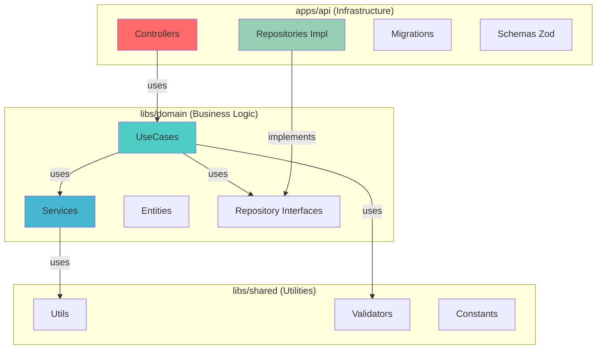

# 📁 Estrutura do Projeto

## Visão Geral

O Common Cornershop é um **monorepo gerenciado pelo NX**, dividido em três camadas principais:

1. **apps/** - Camada de Infraestrutura e Apresentação
2. **libs/domain/** - Camada de Lógica de Negócio
3. **libs/shared/** - Utilitários Compartilhados

---

## Árvore Completa de Diretórios

```
common-cornershop/
├── 📦 apps/
│   └── 🔌 api/                          # Camada de Infraestrutura/Apresentação
│       ├── src/
│       │   ├── main.ts                  # Entry point da aplicação
│       │   ├── config/
│       │   │   ├── database.config.ts
│       │   │   └── database.config.spec.ts
│       │   └── database/
│       │       ├── data-source.ts       # Configuração TypeORM
│       │       └── migrations/          # Migrations do banco
│       │           ├── 1743200000000-CreateCategoryTable.ts
│       │           ├── 1743200010000-CreateProductTable.ts
│       │           ├── 1743200020000-CreateStockTable.ts
│       │           ├── 1743200030000-CreateOrderTable.ts
│       │           └── 1743200040000-CreateOrderItemTable.ts
│       ├── project.json                 # Configuração NX do projeto
│       ├── tsconfig.json                # TypeScript config específico
│       └── tsconfig.spec.json           # TypeScript config para testes
│
├── 📚 libs/
│   ├── 🎯 domain/                       # Camada de Domínio (Lógica de Negócio)
│   │   ├── src/
│   │   │   ├── index.ts                 # Barrel export
│   │   │   ├── entities/                # Entidades de Domínio
│   │   │   │   ├── base.entity.ts
│   │   │   │   ├── category.entity.ts
│   │   │   │   ├── product.entity.ts
│   │   │   │   ├── stock.entity.ts
│   │   │   │   ├── order.entity.ts
│   │   │   │   └── order-item.entity.ts
│   │   │   ├── enums/                   # Enums (ex: OrderStatus)
│   │   │   │   └── order-status.enum.ts
│   │   │   ├── repositories/            # Interfaces dos Repositórios
│   │   │   │   ├── category.repository.ts
│   │   │   │   ├── product.repository.ts
│   │   │   │   ├── stock.repository.ts
│   │   │   │   ├── order.repository.ts
│   │   │   │   └── order-item.repository.ts
│   │   │   ├── use-cases/               # Casos de uso agrupados por entidade
│   │   │   │   ├── category/
│   │   │   │   │   ├── create-category.usecase.ts
│   │   │   │   │   ├── create-category.usecase.spec.ts
│   │   │   │   │   ├── list-categories.usecase.ts
│   │   │   │   │   ├── list-categories.usecase.spec.ts
│   │   │   │   │   ├── get-category.usecase.ts
│   │   │   │   │   ├── get-category.usecase.spec.ts
│   │   │   │   │   ├── update-category.usecase.ts
│   │   │   │   │   ├── update-category.usecase.spec.ts
│   │   │   │   │   ├── delete-category.usecase.ts
│   │   │   │   │   └── delete-category.usecase.spec.ts
│   │   │   │   ├── product/
│   │   │   │   │   ├── create-product.usecase.ts
│   │   │   │   │   ├── create-product.usecase.spec.ts
│   │   │   │   │   ├── list-products.usecase.ts
│   │   │   │   │   ├── list-products.usecase.spec.ts
│   │   │   │   │   ├── get-product.usecase.ts
│   │   │   │   │   ├── get-product.usecase.spec.ts
│   │   │   │   │   ├── update-product.usecase.ts
│   │   │   │   │   ├── update-product.usecase.spec.ts
│   │   │   │   │   ├── delete-product.usecase.ts
│   │   │   │   │   └── delete-product.usecase.spec.ts
│   │   │   │   ├── stock/
│   │   │   │   │   ├── get-stock.usecase.ts
│   │   │   │   │   ├── get-stock.usecase.spec.ts
│   │   │   │   │   ├── update-stock.usecase.ts
│   │   │   │   │   └── update-stock.usecase.spec.ts
│   │   │   │   └── orders/                # ← PR #40 aberto (T2.5)
│   │   │   │       ├── create-order.usecase.ts
│   │   │   │       ├── create-order.usecase.spec.ts
│   │   │   │       ├── get-order.usecase.ts
│   │   │   │       ├── get-order.usecase.spec.ts
│   │   │   │       ├── list-orders.usecase.ts
│   │   │   │       ├── list-orders.usecase.spec.ts
│   │   │   │       ├── update-order-status.usecase.ts
│   │   │   │       ├── update-order-status.usecase.spec.ts
│   │   │   │       ├── cancel-order.usecase.ts
│   │   │   │       └── cancel-order.usecase.spec.ts
│   │   │   ├── services/                  # Serviços (flat)
│   │   │   │   ├── category.service.ts
│   │   │   │   ├── category.service.spec.ts
│   │   │   │   ├── product.service.ts
│   │   │   │   ├── product.service.spec.ts
│   │   │   │   ├── stock.service.ts
│   │   │   │   ├── stock.service.spec.ts
│   │   │   │   └── order.service.ts       # ← PR #40 aberto (T2.5)
│   │   │   ├── errors/                    # Erros de domínio (flat)
│   │   │   │   ├── domain.error.ts
│   │   │   │   ├── category-not-found.error.ts
│   │   │   │   ├── product-not-found.error.ts
│   │   │   │   ├── insufficient-stock.error.ts
│   │   │   │   ├── order-not-found.error.ts
│   │   │   │   └── invalid-order-status-transition.error.ts  # ← PR #40 aberto (T2.5)
│   │   │   └── index.ts
│   │   ├── project.json
│   │   ├── tsconfig.json
│   │   └── tsconfig.spec.json
│   │
│   └── 🔧 shared/                       # Utilitários Compartilhados
│       ├── src/
│       │   ├── index.ts
│       │   ├── utils/                   # Funções auxiliares
│       │   │   ├── string.utils.ts
│       │   │   ├── date.utils.ts
│       │   │   └── number.utils.ts
│       │   ├── validators/              # Validadores customizados
│       │   │   └── uuid.validator.ts
│       │   ├── constants/               # Constantes globais
│       │   │   └── pagination.constants.ts
│       │   └── types/                   # Types compartilhados
│       │       ├── pagination.types.ts
│       │       └── common.types.ts
│       ├── project.json
│       ├── tsconfig.json
│       └── tsconfig.spec.json
│
├── 📄 docs/                             # Documentação (você está aqui!)
│   ├── architecture.md
│   ├── domain-model.md
│   ├── api-endpoints.md
│   ├── conventions.md
│   ├── database.md
│   ├── project-structure.md
│   └── examples.md
│
├── 🧪 tests/                            # Testes E2E
│   └── e2e/
│       └── (vazio no momento)           # ← a ser implementado (T3.3)
│
├── 📋 .github/                          # GitHub configs
│   └── workflows/
│       ├── ci.yml                       # ← a ser implementado (T6.2)
│       └── cd.yml                       # ← a ser implementado (T6.2)
│
├── 🐳 docker-compose.yml                # Configuração Docker
├── .dockerignore
├── Dockerfile
│
├── ⚙️ Configuration Files
├── nx.json                              # Configuração NX
├── package.json                         # Dependências do workspace
├── yarn.lock                            # Lock de dependências
├── tsconfig.base.json                   # TypeScript base config
├── .eslintrc.json                       # ESLint config
├── .prettierrc                          # Prettier config
├── .editorconfig                        # Editor config
├── .nvmrc                               # Node version
├── .gitignore
└── README.md                            # Este arquivo
```

---

## Detalhamento por Camada

### 📦 apps/api/ (Infraestrutura & Apresentação)

Camada responsável por:

- Expor a API HTTP (Fastify)
- Validar requests (Zod schemas)
- Implementar repositórios (TypeORM)
- Gerenciar migrations e seeds
- Configurar dependency injection

**Depende de:** `libs/domain/`, `libs/shared/`

---

#### Subdiretórios Principais

##### 1. `controllers/`

Recebem requests HTTP, validam input e delegam para UseCases.

```typescript
// category.controller.ts - Lista categorias
// product.controller.ts  - CRUD de produtos
// order.controller.ts    - Gestão de pedidos
```

    Nota: a implementação parcial atual entrega o bootstrap da API (T4.1). Os arquivos abaixo já existem em `apps/api/src/`: `main.ts`, `app.ts`, `container/dependency-injection.ts`, `plugins/error-handler.plugin.ts` e stubs em `repositories/*.impl.ts`.

    Observação: a task T4.2 implementou um HTTP schema layer usando Zod em `apps/api/src/http/schemas/` (ex: `categories.schema.ts`, `products.schema.ts`, `orders.schema.ts`, `index.ts`) e adicionou testes unitários em `apps/api/src/http/schemas/__tests__/schemas.spec.ts`. Os schemas são registrados no Fastify por `apps/api/src/plugins/http-schemas.plugin.ts`. Controllers REST ainda seguem em T4.4+.

    Além disso, a task T3.3 adicionou seeds idempotentes sob `apps/api/src/database/seeds/` e o script `yarn seed` foi registrado para popular dados de desenvolvimento (ver docs/database.md).

##### 2. `http/schemas/`

Camada HTTP de validação (Zod) localizada em `apps/api/src/http/schemas/`. Contém os schemas usados pelas rotas (body, params, query, responses) e um `index.ts` que reexporta os componentes.

```typescript
// apps/api/src/http/schemas/index.ts                - Barrel export dos schemas HTTP
// apps/api/src/http/schemas/categories.schema.ts    - Schemas de categoria (query/params/response)
// apps/api/src/http/schemas/products.schema.ts      - Schemas de produto
// apps/api/src/http/schemas/orders.schema.ts        - Schemas de pedido
// apps/api/src/http/schemas/shared/*.schema.ts      - Reutilizáveis (uuid, money, pagination)
```

Há testes de unidade para os schemas em `apps/api/src/http/schemas/__tests__/schemas.spec.ts`.

##### 3. `repositories/`

Implementações TypeORM das interfaces de repositório do domínio. O bootstrap T4.1 adicionou stubs parciais (implementações mínimas) — essas devem ser revisadas, completadas com queries e cobertas por testes de integração (T5.3).

```typescript
// apps/api/src/repositories/
// ├── category.repository.impl.ts       # stub/implem. parcial (T4.1)
// ├── product.repository.impl.ts        # stub/implem. parcial (T4.1)
// ├── stock.repository.impl.ts          # stub/implem. parcial (T4.1)
// ├── order.repository.impl.ts          # stub/implem. parcial (T4.1)
// └── order-item.repository.impl.ts     # stub/implem. parcial (T4.1)
```

Nota: revisar e completar as implementações (queries, relacionamentos e testes de integração) continua como próximo passo. Enquanto isso, os stubs já são registrados no container (apps/api/src/container/dependency-injection.ts) conforme T4.1.

##### 4. `database/`

Configuração de banco, migrations e seeds.

```typescript
// data-source.ts  - Configuração TypeORM
// migrations/     - Versionamento do schema
// seeds/          - Dados iniciais
```

##### 5. `container/`

Configuração do TSyringe (Dependency Injection).

```typescript
// apps/api/src/container/dependency-injection.ts  # Registra tokens e implementações (entregue T4.1)
```

Nota: o container central foi adicionado como parte do bootstrap T4.1. Revisões e adições de bindings são esperadas à medida que repositórios e controllers forem implementados.

---

### 📚 libs/domain/ (Lógica de Negócio)

Camada responsável por:

- Definir entidades de domínio
- Implementar regras de negócio
- Orquestrar casos de uso
- Definir interfaces de repositórios

**Depende de:** `libs/shared/`  
**NÃO depende de:** frameworks, bibliotecas de infraestrutura

---

#### Subdiretórios Principais

##### 1. `entities/`

Entidades de domínio com TypeORM decorators.

```typescript
// base.entity.ts       - Entidade base (id, timestamps, soft delete)
// category.entity.ts   - Categoria
// product.entity.ts    - Produto
// stock.entity.ts      - Estoque
// order.entity.ts      - Pedido
// order-item.entity.ts - Item do pedido
```

##### 2. `repositories/`

Interfaces dos repositórios (contratos).

```typescript
// Interface IProductRepository define métodos
// Implementação fica em apps/api/src/repositories/
```

##### 3. `{module}/use-cases/`

Casos de uso (orquestração de lógica de negócio).

```typescript
// NOTE: Use-cases are implemented in a flat grouped-by-entity layout under `libs/domain/src/use-cases/`.
// Examples (actual files):
// category/create-category.usecase.ts + .spec.ts
// category/list-categories.usecase.ts + .spec.ts
// product/create-product.usecase.ts + .spec.ts
// product/list-products.usecase.ts + .spec.ts
// stock/get-stock.usecase.ts + .spec.ts
// orders/create-order.usecase.ts + .spec.ts   ← PR #40 aberto (T2.5)
```

##### 4. `{module}/services/`

Serviços de negócio reutilizáveis.

```typescript
// order-calculation.service.ts - Cálculo de totais
// stock-management.service.ts  - Gestão de estoque
// product-price.service.ts     - Cálculo de preços
```

##### 5. `dtos/`

Data Transfer Objects (tipos para transferência de dados).

```typescript
// NOTE: There is NO `dtos/` directory in the implemented codebase. DTOs are declared as inline TypeScript
// interfaces inside the use-case or service file where they are needed (for example: CreateCategoryDTO is
// declared inside category.service.ts). When needed by other layers, they are re-exported from the barrel `index.ts`.
```

---

### 🔧 libs/shared/ (Utilitários)

Camada responsável por:

- Funções auxiliares reutilizáveis
- Validadores customizados
- Constantes globais
- Types compartilhados

**Não depende de nenhuma outra camada**

---

#### Subdiretórios Principais

##### 1. `utils/`

Funções auxiliares puras.

```typescript
// string.utils.ts - Manipulação de strings
// date.utils.ts   - Manipulação de datas
// number.utils.ts - Formatação de números
```

##### 2. `validators/`

Validadores reutilizáveis.

```typescript
// uuid.validator.ts - Validação de UUID
```

##### 3. `constants/`

Constantes globais.

```typescript
// pagination.constants.ts - DEFAULT_PAGE_SIZE, MAX_PAGE_SIZE
```

##### 4. `types/`

Types TypeScript compartilhados.

```typescript
// pagination.types.ts - PaginatedResult<T>, PaginationParams
// common.types.ts     - Types genéricos
```

---

## Organização por Feature

Cada módulo de domínio segue a estrutura:

```
{module}/
├── use-cases/       # Orquestração (entry points)
├── services/        # Lógica de negócio reutilizável
└── (opcional) errors/    # Erros customizados do módulo
```

**Exemplo: orders/**

```
orders/
├── use-cases/
│   ├── create-order.usecase.ts
│   ├── list-orders.usecase.ts
│   ├── get-order-by-id.usecase.ts
│   └── get-order-status.usecase.ts
├── services/
│   ├── order-calculation.service.ts
│   └── order-validation.service.ts
└── errors/
    ├── insufficient-stock.error.ts
    └── order-not-found.error.ts
```

---

## Separação de Responsabilidades



---

## Fluxo de Dependências

```
apps/api
   ↓ (depende)
libs/domain
   ↓ (depende)
libs/shared
```

**Regra de Ouro:** Dependências só podem apontar para baixo, nunca para cima!

---

## NX Workspace

### Benefícios do Monorepo

✅ **Compartilhamento de código** - Reutilização entre apps  
✅ **Builds incrementais** - Cache inteligente  
✅ **Análise de dependências** - Visualização do grafo  
✅ **Testes paralelos** - Execução otimizada  
✅ **Geração de código** - Scaffolding consistente

### Comandos NX Úteis

```bash
# Visualizar grafo de dependências
yarn nx graph

# Rodar testes apenas de projetos afetados
yarn nx affected:test

# Compilar apenas projetos afetados
yarn nx affected:build

# Limpar cache
yarn nx reset
```

---

## Convenções de Nomenclatura

| Tipo             | Padrão                         | Exemplo                        |
| ---------------- | ------------------------------ | ------------------------------ |
| **Diretórios**   | `kebab-case`                   | `order-items/`, `use-cases/`   |
| **Arquivos**     | `{nome}.{tipo}.{ext}`          | `product.service.ts`           |
| **Entities**     | `{nome}.entity.ts`             | `order.entity.ts`              |
| **UseCases**     | `{action}-{entity}.usecase.ts` | `create-order.usecase.ts`      |
| **Services**     | `{nome}.service.ts`            | `order-calculation.service.ts` |
| **Repositories** | `{nome}.repository.ts`         | `product.repository.ts`        |
| **Impl**         | `{nome}.repository.impl.ts`    | `product.repository.impl.ts`   |

---

[⬆ Voltar para README](../README.md)
