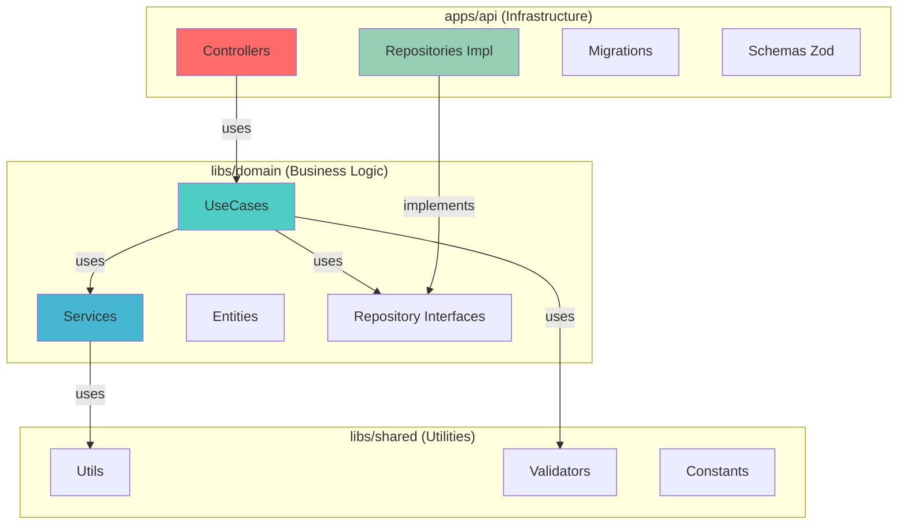

# 📁 Estrutura do Projeto

## Visão Geral

O Common Cornershop é um **monorepo gerenciado pelo NX**, dividido em três camadas principais:

1. **apps/** - Camada de Infraestrutura e Apresentação
2. **libs/domain/** - Camada de Lógica de Negócio
3. **libs/shared/** - Utilitários Compartilhados

---

## Árvore Completa de Diretórios

```
common-cornershop/
├── 📦 apps/
│   └── 🔌 api/                          # Camada de Infraestrutura/Apresentação
│       ├── src/
│       │   ├── main.ts                  # Entry point da aplicação
│       │   ├── app/
│       │   │   ├── app.ts               # Configuração do Fastify
│       │   │   └── routes.ts            # Registro de rotas
│       │   ├── controllers/             # Controllers HTTP
│       │   │   ├── category.controller.ts
│       │   │   ├── product.controller.ts
│       │   │   └── order.controller.ts
│       │   ├── schemas/                 # Schemas Zod para validação
│       │   │   ├── category.schema.ts
│       │   │   ├── product.schema.ts
│       │   │   ├── order.schema.ts
│       │   │   └── pagination.schema.ts
│       │   ├── repositories/            # Implementações TypeORM
│       │   │   ├── category.repository.impl.ts
│       │   │   ├── product.repository.impl.ts
│       │   │   ├── stock.repository.impl.ts
│       │   │   ├── order.repository.impl.ts
│       │   │   └── order-item.repository.impl.ts
│       │   ├── database/
│       │   │   ├── data-source.ts       # Configuração TypeORM
│       │   │   ├── migrations/          # Migrations do banco
│       │   │   │   ├── 1710501234567-CreateCategoryTable.ts
│       │   │   │   ├── 1710501298765-CreateProductTable.ts
│       │   │   │   ├── 1710501367890-CreateStockTable.ts
│       │   │   │   ├── 1710501456789-CreateOrderTable.ts
│       │   │   │   └── 1710501523456-CreateOrderItemTable.ts
│       │   │   └── seeds/               # Dados iniciais
│       │   │       ├── index.ts
│       │   │       ├── category.seed.ts
│       │   │       └── product.seed.ts
│       │   ├── container/
│       │   │   └── dependency-injection.ts  # Setup TSyringe
│       │   ├── middlewares/             # Middlewares Fastify
│       │   │   ├── error-handler.middleware.ts
│       │   │   └── logger.middleware.ts
│       │   ├── plugins/                 # Plugins Fastify
│       │   │   └── cors.plugin.ts
│       │   └── config/                  # Configurações
│       │       ├── env.config.ts
│       │       └── database.config.ts
│       ├── project.json                 # Configuração NX do projeto
│       ├── tsconfig.json                # TypeScript config específico
│       └── tsconfig.spec.json           # TypeScript config para testes
│
├── 📚 libs/
│   ├── 🎯 domain/                       # Camada de Domínio (Lógica de Negócio)
│   │   ├── src/
│   │   │   ├── index.ts                 # Barrel export
│   │   │   ├── entities/                # Entidades de Domínio
│   │   │   │   ├── base.entity.ts
│   │   │   │   ├── category.entity.ts
│   │   │   │   ├── product.entity.ts
│   │   │   │   ├── stock.entity.ts
│   │   │   │   ├── order.entity.ts
│   │   │   │   └── order-item.entity.ts
│   │   │   ├── enums/
│   │   │   │   └── order-status.enum.ts
│   │   │   ├── dtos/                    # Data Transfer Objects
│   │   │   │   ├── category.dto.ts
│   │   │   │   ├── product.dto.ts
│   │   │   │   ├── order.dto.ts
│   │   │   │   └── pagination.dto.ts
│   │   │   ├── repositories/            # Interfaces dos Repositórios
│   │   │   │   ├── category.repository.ts
│   │   │   │   ├── product.repository.ts
│   │   │   │   ├── stock.repository.ts
│   │   │   │   ├── order.repository.ts
│   │   │   │   └── order-item.repository.ts
│   │   │   ├── categories/
│   │   │   │   ├── use-cases/           # Casos de uso de categorias
│   │   │   │   │   ├── list-categories.usecase.ts
│   │   │   │   │   ├── get-category-by-id.usecase.ts
│   │   │   │   │   ├── create-category.usecase.ts
│   │   │   │   │   └── update-category.usecase.ts
│   │   │   │   └── services/            # Serviços de negócio
│   │   │   │       └── category-validation.service.ts
│   │   │   ├── products/
│   │   │   │   ├── use-cases/
│   │   │   │   │   ├── list-products.usecase.ts
│   │   │   │   │   ├── get-product-by-id.usecase.ts
│   │   │   │   │   ├── create-product.usecase.ts
│   │   │   │   │   └── update-product.usecase.ts
│   │   │   │   └── services/
│   │   │   │       ├── product-validation.service.ts
│   │   │   │       └── product-price.service.ts
│   │   │   ├── stock/
│   │   │   │   ├── use-cases/
│   │   │   │   │   ├── update-stock.usecase.ts
│   │   │   │   │   └── check-stock-availability.usecase.ts
│   │   │   │   └── services/
│   │   │   │       └── stock-management.service.ts
│   │   │   └── orders/
│   │   │       ├── use-cases/
│   │   │       │   ├── create-order.usecase.ts
│   │   │       │   ├── list-orders.usecase.ts
│   │   │       │   ├── get-order-by-id.usecase.ts
│   │   │       │   └── get-order-status.usecase.ts
│   │   │       └── services/
│   │   │           ├── order-calculation.service.ts
│   │   │           └── order-validation.service.ts
│   │   ├── project.json
│   │   ├── tsconfig.json
│   │   └── tsconfig.spec.json
│   │
│   └── 🔧 shared/                       # Utilitários Compartilhados
│       ├── src/
│       │   ├── index.ts
│       │   ├── utils/                   # Funções auxiliares
│       │   │   ├── string.utils.ts
│       │   │   ├── date.utils.ts
│       │   │   └── number.utils.ts
│       │   ├── validators/              # Validadores customizados
│       │   │   └── uuid.validator.ts
│       │   ├── constants/               # Constantes globais
│       │   │   └── pagination.constants.ts
│       │   └── types/                   # Types compartilhados
│       │       ├── pagination.types.ts
│       │       └── common.types.ts
│       ├── project.json
│       ├── tsconfig.json
│       └── tsconfig.spec.json
│
├── 📄 docs/                             # Documentação (você está aqui!)
│   ├── architecture.md
│   ├── domain-model.md
│   ├── api-endpoints.md
│   ├── conventions.md
│   ├── database.md
│   ├── project-structure.md
│   └── examples.md
│
├── 🧪 tests/                            # Testes E2E
│   └── e2e/
│       ├── orders.e2e-spec.ts
│       └── products.e2e-spec.ts
│
├── 📋 .github/                          # GitHub configs
│   └── workflows/
│       ├── ci.yml
│       └── cd.yml
│
├── 🐳 docker-compose.yml                # Configuração Docker
├── .dockerignore
├── Dockerfile
│
├── ⚙️ Configuration Files
├── nx.json                              # Configuração NX
├── package.json                         # Dependências do workspace
├── yarn.lock                            # Lock de dependências
├── tsconfig.base.json                   # TypeScript base config
├── .eslintrc.json                       # ESLint config
├── .prettierrc                          # Prettier config
├── .editorconfig                        # Editor config
├── .nvmrc                               # Node version
├── .gitignore
└── README.md                            # Este arquivo
```

---

## Detalhamento por Camada

### 📦 apps/api/ (Infraestrutura & Apresentação)

Camada responsável por:
- Expor a API HTTP (Fastify)
- Validar requests (Zod schemas)
- Implementar repositórios (TypeORM)
- Gerenciar migrations e seeds
- Configurar dependency injection

**Depende de:** `libs/domain/`, `libs/shared/`

---

#### Subdiretórios Principais

##### 1. `controllers/`
Recebem requests HTTP, validam input e delegam para UseCases.

```typescript
// category.controller.ts - Lista categorias
// product.controller.ts  - CRUD de produtos
// order.controller.ts    - Gestão de pedidos
```

##### 2. `schemas/`
Schemas Zod para validação de requests.

```typescript
// category.schema.ts   - Schemas de categoria
// product.schema.ts    - Schemas de produto
// order.schema.ts      - Schemas de pedido
// pagination.schema.ts - Schema de paginação
```

##### 3. `repositories/`
Implementações TypeORM das interfaces de repositório do domínio.

```typescript
// category.repository.impl.ts
// product.repository.impl.ts
// stock.repository.impl.ts
// order.repository.impl.ts
// order-item.repository.impl.ts
```

##### 4. `database/`
Configuração de banco, migrations e seeds.

```typescript
// data-source.ts  - Configuração TypeORM
// migrations/     - Versionamento do schema
// seeds/          - Dados iniciais
```

##### 5. `container/`
Configuração do TSyringe (Dependency Injection).

```typescript
// dependency-injection.ts - Registra todas as dependências
```

---

### 📚 libs/domain/ (Lógica de Negócio)

Camada responsável por:
- Definir entidades de domínio
- Implementar regras de negócio
- Orquestrar casos de uso
- Definir interfaces de repositórios

**Depende de:** `libs/shared/`  
**NÃO depende de:** frameworks, bibliotecas de infraestrutura

---

#### Subdiretórios Principais

##### 1. `entities/`
Entidades de domínio com TypeORM decorators.

```typescript
// base.entity.ts       - Entidade base (id, timestamps, soft delete)
// category.entity.ts   - Categoria
// product.entity.ts    - Produto
// stock.entity.ts      - Estoque
// order.entity.ts      - Pedido
// order-item.entity.ts - Item do pedido
```

##### 2. `repositories/`
Interfaces dos repositórios (contratos).

```typescript
// Interface IProductRepository define métodos
// Implementação fica em apps/api/src/repositories/
```

##### 3. `{module}/use-cases/`
Casos de uso (orquestração de lógica de negócio).

```typescript
// create-order.usecase.ts     - Criar pedido
// list-products.usecase.ts    - Listar produtos
// get-order-status.usecase.ts - Obter status
```

##### 4. `{module}/services/`
Serviços de negócio reutilizáveis.

```typescript
// order-calculation.service.ts - Cálculo de totais
// stock-management.service.ts  - Gestão de estoque
// product-price.service.ts     - Cálculo de preços
```

##### 5. `dtos/`
Data Transfer Objects (tipos para transferência de dados).

```typescript
// category.dto.ts   - DTOs de categoria
// product.dto.ts    - DTOs de produto
// order.dto.ts      - DTOs de pedido
// pagination.dto.ts - DTO de paginação
```

---

### 🔧 libs/shared/ (Utilitários)

Camada responsável por:
- Funções auxiliares reutilizáveis
- Validadores customizados
- Constantes globais
- Types compartilhados

**Não depende de nenhuma outra camada**

---

#### Subdiretórios Principais

##### 1. `utils/`
Funções auxiliares puras.

```typescript
// string.utils.ts - Manipulação de strings
// date.utils.ts   - Manipulação de datas
// number.utils.ts - Formatação de números
```

##### 2. `validators/`
Validadores reutilizáveis.

```typescript
// uuid.validator.ts - Validação de UUID
```

##### 3. `constants/`
Constantes globais.

```typescript
// pagination.constants.ts - DEFAULT_PAGE_SIZE, MAX_PAGE_SIZE
```

##### 4. `types/`
Types TypeScript compartilhados.

```typescript
// pagination.types.ts - PaginatedResult<T>, PaginationParams
// common.types.ts     - Types genéricos
```

---

## Organização por Feature

Cada módulo de domínio segue a estrutura:

```
{module}/
├── use-cases/       # Orquestração (entry points)
├── services/        # Lógica de negócio reutilizável
└── (opcional) errors/    # Erros customizados do módulo
```

**Exemplo: orders/**

```
orders/
├── use-cases/
│   ├── create-order.usecase.ts
│   ├── list-orders.usecase.ts
│   ├── get-order-by-id.usecase.ts
│   └── get-order-status.usecase.ts
├── services/
│   ├── order-calculation.service.ts
│   └── order-validation.service.ts
└── errors/
    ├── insufficient-stock.error.ts
    └── order-not-found.error.ts
```

---

## Separação de Responsabilidades



---

## Fluxo de Dependências

```
apps/api
   ↓ (depende)
libs/domain
   ↓ (depende)
libs/shared
```

**Regra de Ouro:** Dependências só podem apontar para baixo, nunca para cima!

---

## NX Workspace

### Benefícios do Monorepo

✅ **Compartilhamento de código** - Reutilização entre apps  
✅ **Builds incrementais** - Cache inteligente  
✅ **Análise de dependências** - Visualização do grafo  
✅ **Testes paralelos** - Execução otimizada  
✅ **Geração de código** - Scaffolding consistente

### Comandos NX Úteis

```bash
# Visualizar grafo de dependências
yarn nx graph

# Rodar testes apenas de projetos afetados
yarn nx affected:test

# Compilar apenas projetos afetados
yarn nx affected:build

# Limpar cache
yarn nx reset
```

---

## Convenções de Nomenclatura

| Tipo | Padrão | Exemplo |
|------|--------|---------|
| **Diretórios** | `kebab-case` | `order-items/`, `use-cases/` |
| **Arquivos** | `{nome}.{tipo}.{ext}` | `product.service.ts` |
| **Entities** | `{nome}.entity.ts` | `order.entity.ts` |
| **UseCases** | `{action}-{entity}.usecase.ts` | `create-order.usecase.ts` |
| **Services** | `{nome}.service.ts` | `order-calculation.service.ts` |
| **Repositories** | `{nome}.repository.ts` | `product.repository.ts` |
| **Impl** | `{nome}.repository.impl.ts` | `product.repository.impl.ts` |

---

[⬆ Voltar para README](../README.md)
