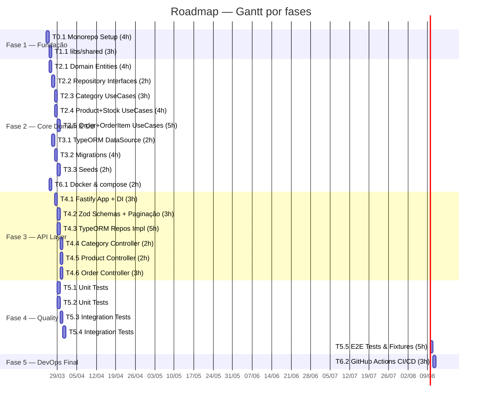

# Roadmap — Common Cornershop 📍

Data de criação: 2026-03-25
Última atualização: 2026-03-31

GitHub Project: https://github.com/users/Vandrs/projects/2


---

1. Header

- Título: Roadmap — Common Cornershop
- Data de criação: 2026-03-25
- GitHub Project: https://github.com/users/Vandrs/projects/2
- Status: Em andamento

---

2. Visão Geral

Common Cornershop é uma API REST para gestão de lojas de esquina. Este roadmap cobre a implementação inicial (MVP técnico) a partir de um repositório que hoje contém apenas documentação. Arquitetura: NX monorepo, Clean Architecture e DDD. Stack alvo: Node.js 18, TypeScript 5, Fastify, TypeORM, PostgreSQL 14, TSyringe, Zod, Jest.

O documento define as tasks, dependências, paralelismos e critérios de conclusão para que um time pequeno inicie a implementação com baixo risco e PRs pequenos.

---

3. Status do Projeto

| Fase                      | Período sugerido | Status       |
| ------------------------- | ---------------- | ------------ |
| Fase 1 — Fundação         | Semana 1         | ✅ Concluída |
| Fase 2 — Core Domain & DB | Semana 1–2       | ✅ Concluída |
| Fase 3 — API Layer        | Semana 2–3       | Em andamento |
| Fase 4 — Quality          | Semana 3–4       | Não iniciado |
| Fase 5 — DevOps Final     | Semana 4         | Não iniciado |

---

4. Diagrama de Dependências (Mermaid)

```mermaid
graph LR
  %% Subgraphs por camada
  subgraph Fundação
    T0_1[T0.1\n#2\nMonorepo Setup]
  end

  subgraph Shared
    T1_1[T1.1\n#3\nlibs/shared]
  end

  subgraph Domain
    T2_1[T2.1\n#4\nDomain Entities]
    T2_2[T2.2\n#5\nRepository Interfaces]
    T2_3[T2.3\n#6\nCategory UseCases]
    T2_4[T2.4\n#7\nProduct+Stock UseCases]
    T2_5[T2.5\n#8\nOrder+OrderItem UseCases]
  end

  subgraph Infra_DB
    T3_1[T3.1\n#9\nTypeORM DataSource]
    T3_2[T3.2\n#10\nMigrations (5 tabelas)]
    T3_3[T3.3\n#11\nSeeds (Cat/Prod/Stock)]
  end

  subgraph Infra_API
    T4_1[T4.1\n#12\nFastify App + DI]
    T4_2[T4.2\n#13\nZod Schemas + Paginação]
    T4_3[T4.3\n#14\nTypeORM Repositories Impl.]
    T4_4[T4.4\n#15\nCategory Controller]
    T4_5[T4.5\n#16\nProduct Controller]
    T4_6[T4.6\n#17\nOrder Controller]
  end

  subgraph Testes
    T5_1[T5.1\n#18\nUnit Tests: Domain Services]
    T5_2[T5.2\n#19\nUnit Tests: UseCases w/ mocks]
    T5_3[T5.3\n#20\nIntegration Tests: Repos]
    T5_4[T5.4\n#21\nIntegration Tests: Controllers]
    T5_5[T5.5\n#22\nE2E Tests & Fixtures]
  end

  subgraph DevOps
    T6_1[T6.1\n#23\nDocker + docker-compose]
    T6_2[T6.2\n#24\nGitHub Actions CI/CD]
  end

  %% Dependências exatas
  T0_1 --> T1_1
  T1_1 --> T2_1
  T2_1 --> T2_2
  T2_2 --> T2_3
  T2_2 --> T2_4
  T2_4 --> T2_5

  T2_1 --> T3_1
  T3_1 --> T3_2
  T3_2 --> T3_3

  T2_2 --> T4_1
  T3_1 --> T4_1
  T4_1 --> T4_2
  T4_1 --> T4_3
  T2_2 --> T4_3

  T4_2 --> T4_4
  T4_3 --> T4_4
  T2_3 --> T4_4

  T4_2 --> T4_5
  T4_3 --> T4_5
  T2_4 --> T4_5

  T4_2 --> T4_6
  T4_3 --> T4_6
  T2_5 --> T4_6

  T2_3 --> T5_1
  T2_4 --> T5_1
  T2_5 --> T5_1

  T2_3 --> T5_2
  T2_4 --> T5_2
  T2_5 --> T5_2

  T4_3 --> T5_3
  T3_2 --> T5_3

  T4_4 --> T5_4
  T4_5 --> T5_4
  T4_6 --> T5_4

  T4_4 --> T5_5
  T4_5 --> T5_5
  T4_6 --> T5_5
  T3_3 --> T5_5

  T0_1 --> T6_1
  T5_5 --> T6_2
  T6_1 --> T6_2

```

---

5. Execução em Paralelo (Grupos P1 a P7) — instruções acionáveis

> Nota: cada item abaixo é um callout acionável. "após fechar a issue X, as issues Y e Z podem ser iniciadas em paralelo".

> Grupo P1 — após fechar T2.2 [#5], iniciar em paralelo: T2.3 [#6] e T2.4 [#7].

> - T2.2 → T2.3 [#6] (paralelo)
> - T2.2 → T2.4 [#7] (paralelo)
> - Observação: T2.5 [#8] só pode iniciar após T2.4 concluir (T2.2 + T2.4).

> Grupo P2 — após fechar T2.1 [#4], iniciar: T3.1 [#9] (trail DB, independente do restante).

> Grupo P3 — após fechar T4.1 [#12], iniciar em paralelo: T4.2 [#13] e T4.3 [#14].

> Grupo P4 — após T4.2 [#13] + T4.3 [#14] (e os pré-requisitos de domain indicados): iniciar em paralelo: T4.4 [#15], T4.5 [#16], T4.6 [#17].

> Grupo P5 — após T2.3 [#6] + T2.4 [#7] + T2.5 [#8]: iniciar em paralelo: T5.1 [#18] e T5.2 [#19].

> Grupo P6 — T5.3 [#20] pode iniciar assim que T4.3 [#14] e T3.2 [#10] estiverem fechadas; pode rodar paralelo a P5.

> Grupo P7 — T6.1 [#23] pode iniciar logo após T0.1 [#2] e executar em paralelo a todas as outras tasks; T6.2 [#24] depende de T6.1 e de T5.5.

---

6. Gantt (Mermaid) — fases com paralelismo visual



---

7. Fases Detalhadas

### Fase 1 — Fundação

- Objetivo: estabelecer monorepo NX, TypeScript, lint e shared libs.

| ID   | Issue |                                                       Título | Estimativa | Prioridade | Status       | Link                                                       |
| ---- | ----- | -----------------------------------------------------------: | ---------: | ---------- | ------------ | ---------------------------------------------------------- |
| T0.1 | #2    | Monorepo Setup — NX + TypeScript + ESLint + Prettier + Husky |         4h | Alta       | ✅ Concluído | [#2](https://github.com/Vandrs/common-cornershop/issues/2) |
| T1.1 | #3    |           libs/shared — Utils, Validators, Constants e Types |         3h | Alta       | ✅ Concluído | [#3](https://github.com/Vandrs/common-cornershop/issues/3) |

- Critério de conclusão: `yarn nx graph` funciona; shared exportável; ESLint/Prettier/Husky ativos.

### Fase 2 — Core Domain & Banco

- Objetivo: modelar domínio, contratos de repositório e configurar DB com migrations+seeds.

| ID   | Issue |                                                        Título | Estimativa | Prioridade | Status       | Link                                                         |
| ---- | ----- | ------------------------------------------------------------: | ---------: | ---------- | ------------ | ------------------------------------------------------------ |
| T2.1 | #4    |              Domain — Entities, BaseEntity e OrderStatus Enum |         4h | Alta       | ✅ Concluído | [#4](https://github.com/Vandrs/common-cornershop/issues/4)   |
| T2.2 | #5    |                  Domain — Repository Interfaces (5 contratos) |         2h | Alta       | ✅ Concluído | [#5](https://github.com/Vandrs/common-cornershop/issues/5)   |
| T2.3 | #6    |                        Domain — Category: UseCases e Services |         3h | Média      | ✅ Concluída | [#6](https://github.com/Vandrs/common-cornershop/issues/6)   |
| T2.4 | #7    |                 Domain — Product + Stock: UseCases e Services |         4h | Média      | ✅ Concluída | [#7](https://github.com/Vandrs/common-cornershop/issues/7)   |
| T2.5 | #8    |               Domain — Order + OrderItem: UseCases e Services |         5h | Média      | ✅ Concluída | [#8](https://github.com/Vandrs/common-cornershop/issues/8)   |
| T3.1 | #9    | Infra DB — TypeORM DataSource, Config e variáveis de ambiente |         2h | Alta       | ✅ Concluída | [#9](https://github.com/Vandrs/common-cornershop/issues/9)   |
| T3.2 | #10   |                             Infra DB — Migrations (5 tabelas) |         4h | Alta       | ✅ Concluída | [#10](https://github.com/Vandrs/common-cornershop/issues/10) |
| T3.3 | #11   |               Infra DB — Seeds (Categories, Products e Stock) |         2h | Média      | ✅ Concluído | [#11](https://github.com/Vandrs/common-cornershop/issues/11) |
| T6.1 | #23   |           DevOps — Docker e docker-compose (app + PostgreSQL) |         2h | Média      | ✅ Concluído | [#23](https://github.com/Vandrs/common-cornershop/issues/23) |

- Nota: T2.3 implementado na branch `feat/T2.3-category-usecases`.

- Critério de conclusão: migrations aplicam sem erro; seeds populam dados; use cases core têm testes unitários básicos.

### Notas de status

- T2.3 e T2.4: entregues nas branches de feature correspondentes (ver histórico das branches das tasks T2.3 e T2.4 nos PRs).
- T3.1: entregue nesta branch: `feat/T3.1-typeorm-datasource`.
- T3.3: Seeds idempotentes implementadas em `apps/api/src/database/seeds/` com entrypoint `run-seeds.ts` e script `yarn seed` (ver detalhe em docs/database.md). ✅ Concluído.
- T4.1: Fastify bootstrap e container DI entregues na branch `feat/T4.1-fastify-bootstrap` — inclui `main.ts`, `app.ts`, `apps/api/src/container/dependency-injection.ts`, `apps/api/src/plugins/error-handler.plugin.ts`, e stubs de `repositories/*.impl.ts`. ✅ Concluído.
- T4.2: Zod HTTP schemas implementados e registrados — arquivos em `apps/api/src/http/schemas/` (categories/products/orders + shared), plugin de registro em `apps/api/src/plugins/http-schemas.plugin.ts`, Swagger plugin em `apps/api/src/plugins/swagger.plugin.ts`, e bootstrap wiring em `apps/api/src/app.ts` que registra ambos. Testes de schemas em `apps/api/src/http/schemas/__tests__/schemas.spec.ts`. ✅ Concluído.
- T2.5: entregue na branch `feat/T2.5-order-usecases` — OrderService, InvalidOrderStatusTransitionError e 5 UseCases (Create, Get, List, UpdateStatus, Cancel) com 37 novos testes unitários.
- T3.2: entregue na branch `feat/T3.2-database-migrations` — 5 migrations TypeORM (categories → products → stocks → orders → order_items) com FKs, índices e check constraints.
- T5.1 / T5.2: Unit tests para Services e UseCases implementados e com cobertura alinhada às metas (ver docs/testing.md). ✅ Concluído.

Nota de status geral:

- Fase 2 (Core Domain & DB) está agora marcada como CONCLUÍDA — inclui migrations (T3.2) e seeds idempotentes (T3.3).
- Fase 3 (API Layer) está EM ANDAMENTO: o bootstrap Fastify + DI + error handler foi entregue (T4.1) e repositórios parciais (stubs) estão no repositório; controllers e rotas seguem em T4.4+.
- Fase 3 (API Layer) está EM ANDAMENTO: o bootstrap Fastify + DI + error handler foi entregue (T4.1) e repositórios parciais (stubs) estão no repositório; controllers e rotas seguem em T4.4+. Completamos T4.2 (HTTP schema layer + Swagger) — os próximos passos são mapear controllers para usar os novos schemas e adicionar integração/contract tests.

Referências rápidas: T3.3 (seeds), T4.1 (Fastify bootstrap & DI), T5.1/T5.2 (testes unitários com cobertura) são marcos já entregues.

### Fase 3 — API Layer

- Objetivo: expor use cases via Fastify, validação Zod e implementar repositórios TypeORM.

| ID   | Issue |                                                          Título | Estimativa | Prioridade | Status          | Link                                                         |
| ---- | ----- | --------------------------------------------------------------: | ---------: | ---------- | --------------- | ------------------------------------------------------------ |
| T4.1 | #12   |       Infra API — Fastify App Bootstrap e TSyringe DI Container |         3h | Alta       | ✅ Concluído    | [#12](https://github.com/Vandrs/common-cornershop/issues/12) |
| T4.2 | #13   |                Infra API — Zod Schemas de validação e Paginação |         3h | Alta       | ✅ Concluída    | [#13](https://github.com/Vandrs/common-cornershop/issues/13) |
| T4.3 | #14   | Infra API — Repository Implementations TypeORM (5 repositórios) |         5h | Alta       | ⬜ Não iniciado | [#14](https://github.com/Vandrs/common-cornershop/issues/14) |
| T4.4 | #15   |                         Infra API — Category Controller e Rotas |         2h | Média      | ⬜ Não iniciado | [#15](https://github.com/Vandrs/common-cornershop/issues/15) |
| T4.5 | #16   |                          Infra API — Product Controller e Rotas |         2h | Média      | ⬜ Não iniciado | [#16](https://github.com/Vandrs/common-cornershop/issues/16) |
| T4.6 | #17   |                            Infra API — Order Controller e Rotas |         3h | Média      | ⬜ Não iniciado | [#17](https://github.com/Vandrs/common-cornershop/issues/17) |

- Critério de conclusão: endpoints básicos (categories, products, orders) respondendo com validação e integração com DB.

### Fase 4 — Quality

- Objetivo: garantir cobertura de testes nas camadas críticas e integrar testes E2E.

| ID   | Issue |                                                     Título | Estimativa | Prioridade | Status          | Link                                                         |
| ---- | ----- | ---------------------------------------------------------: | ---------: | ---------- | --------------- | ------------------------------------------------------------ |
| T5.1 | #18   |                       Testes — Unit Tests: Domain Services |         4h | Média      | ✅ Concluído    | [#18](https://github.com/Vandrs/common-cornershop/issues/18) |
| T5.2 | #19   |                    Testes — Unit Tests: UseCases com mocks |         4h | Média      | ✅ Concluído    | [#19](https://github.com/Vandrs/common-cornershop/issues/19) |
| T5.3 | #20   |     Testes — Integration Tests: Repository Implementations |         4h | Média      | ⬜ Não iniciado | [#20](https://github.com/Vandrs/common-cornershop/issues/20) |
| T5.4 | #21   | Testes — Integration Tests: Controllers com Fastify inject |         4h | Média      | ⬜ Não iniciado | [#21](https://github.com/Vandrs/common-cornershop/issues/21) |
| T5.5 | #22   |                   Testes — E2E Tests, Fixtures e Factories |         5h | Baixa      | ⬜ Não iniciado | [#22](https://github.com/Vandrs/common-cornershop/issues/22) |

- Critério de conclusão: `yarn test` verde; E2E básicos passando contra docker-compose; cobertura mínima nas services e usecases.

### Fase 5 — DevOps Final

- Objetivo: CI/CD mínimo com GitHub Actions.

| ID   | Issue |                                              Título | Estimativa | Prioridade | Status          | Link                                                         |
| ---- | ----- | --------------------------------------------------: | ---------: | ---------- | --------------- | ------------------------------------------------------------ |
| T6.2 | #24   | DevOps — GitHub Actions CI/CD (test + build + lint) |         3h | Baixa      | ⬜ Não iniciado | [#24](https://github.com/Vandrs/common-cornershop/issues/24) |

- Critério de conclusão: PRs disparam workflow que roda lint, tests e build; PRs bloqueados em caso de falha.

---

8. Caminho Crítico

Sequência (horas acumuladas):

1. T0.1 — 4h (acumulado 4h)
2. T1.1 — 3h (7h)
3. T2.1 — 4h (11h)
4. T2.2 — 2h (13h)
5. T2.4 — 4h (17h)
6. T2.5 — 5h (22h)
7. T4.1 — 3h (25h)
8. T4.3 — 5h (30h)
9. T4.6 — 3h (33h)
10. T5.4 — 4h (37h)
11. T5.5 — 5h (42h)
12. T6.2 — 3h (45h)

Total caminho crítico: 45h

Observação: o cálculo considera dependências exatas fornecidas; paralelismo entre outras tasks pode reduzir o tempo de calendário do projeto.

---

9. Tabela de Estimativas por Fase

| Fase                      | Soma horas (total) | Horas com paralelismo (estimado) |
| ------------------------- | -----------------: | -------------------------------: |
| Fase 1 — Fundação         |                 7h |                               7h |
| Fase 2 — Core Domain & DB |                26h |                              12h |
| Fase 3 — API Layer        |                18h |                              11h |
| Fase 4 — Quality          |                21h |                               9h |
| Fase 5 — DevOps Final     |                 5h |                               3h |
| **Total**                 |            **77h** |              **~42h (estimado)** |

Notas: soma das estimativas por task = 77h. Horas com paralelismo são estimativas de calendário considerando que tasks independentes rodem ao mesmo tempo por diferentes desenvolvedores.

---

10. Guia de Início — Primeiro Dia

1. Criar branch `feature/setup/monorepo` e abrir PR para T0.1 [#2](https://github.com/Vandrs/common-cornershop/issues/2). Incluir README básico e scripts yarn.
1. Após merge de T0.1, criar branch `feature/shared-libs` para T1.1 [#3](https://github.com/Vandrs/common-cornershop/issues/3): implementar libs/shared com exports para DTOs e types (pequena PR).
1. Criar branch `feature/domain/entities` para T2.1 [#4](https://github.com/Vandrs/common-cornershop/issues/4): adicionar entities e enum OrderStatus.
1. Paralelo: se houver segundo dev, iniciar T6.1 `feature/devops/docker` (branch `feature/devops/docker`) para criar docker-compose com PostgreSQL.

Sugestão de convenção de branches: `feature/<ID>-<short-title>` (ex: `feature/T0.1-monorepo-setup`). PRs pequenos (≤ 2–3 arquivos, ≤ 200 linhas) facilitam revisão.

---

11. Pós-MVP (itens do README.md)

Features planejadas (do README):

- Autenticação & Autorização — JWT, roles (admin, user)
- Webhooks — Notificações de mudança de status
- Relatórios — Vendas por período, produtos mais vendidos
- Alertas de Estoque — Notificação quando estoque < mínimo
- Gestão de Clientes — CRUD de clientes
- Pagamentos — Integração com gateways
- API Documentation — Swagger/OpenAPI
- Rate Limiting — Proteção contra abuso
- Caching — Redis para listagens
- CI/CD completo — GitHub Actions

Melhorias técnicas (do README):

- Testes de integração completos
- Documentation as Code (Typedoc)
- Husky + Commitlint
- Health checks
- Docker multi-stage

---

12. Links e Referências

- GitHub Project: https://github.com/users/Vandrs/projects/2

- Issues (links diretos):
  - [#2](https://github.com/Vandrs/common-cornershop/issues/2)
  - [#3](https://github.com/Vandrs/common-cornershop/issues/3)
  - [#4](https://github.com/Vandrs/common-cornershop/issues/4)
  - [#5](https://github.com/Vandrs/common-cornershop/issues/5)
  - [#6](https://github.com/Vandrs/common-cornershop/issues/6)
  - [#7](https://github.com/Vandrs/common-cornershop/issues/7)
  - [#8](https://github.com/Vandrs/common-cornershop/issues/8)
  - [#9](https://github.com/Vandrs/common-cornershop/issues/9)
  - [#10](https://github.com/Vandrs/common-cornershop/issues/10)
  - [#11](https://github.com/Vandrs/common-cornershop/issues/11)
  - [#12](https://github.com/Vandrs/common-cornershop/issues/12)
  - [#13](https://github.com/Vandrs/common-cornershop/issues/13)
  - [#14](https://github.com/Vandrs/common-cornershop/issues/14)
  - [#15](https://github.com/Vandrs/common-cornershop/issues/15)
  - [#16](https://github.com/Vandrs/common-cornershop/issues/16)
  - [#17](https://github.com/Vandrs/common-cornershop/issues/17)
  - [#18](https://github.com/Vandrs/common-cornershop/issues/18)
  - [#19](https://github.com/Vandrs/common-cornershop/issues/19)
  - [#20](https://github.com/Vandrs/common-cornershop/issues/20)
  - [#21](https://github.com/Vandrs/common-cornershop/issues/21)
  - [#22](https://github.com/Vandrs/common-cornershop/issues/22)
  - [#23](https://github.com/Vandrs/common-cornershop/issues/23)
  - [#24](https://github.com/Vandrs/common-cornershop/issues/24)

- Documentação existente no repositório:
  - [architecture.md](docs/architecture.md)
  - [domain-model.md](docs/domain-model.md)
  - [api-endpoints.md](docs/api-endpoints.md)
  - [conventions.md](docs/conventions.md)
  - [database.md](docs/database.md)
  - [project-structure.md](docs/project-structure.md)
  - [testing.md](docs/testing.md)

---

Arquivo gerado em: /docs/roadmap.md
